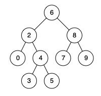

## 217. 存在重复元素

给定一个整数数组，判断是否存在重复元素。

如果任何值在数组中出现至少两次，函数返回 true。如果数组中每个元素都不相同，则返回 false。

example:

```
输入: [1,2,3,1]
输出: true
```

> 思路: map 存储已知元素。

```javascript
/**
 * @param {number[]} nums
 * @return {boolean}
 */
var containsDuplicate = function(nums) {
  let tmp = {};
  for (let val of nums) {
    if (tmp[val]) return true;
    tmp[val] = true
  }
  return false
};
```

## 219. 存在重复元素 II

给定一个整数数组和一个整数 k，判断数组中是否存在两个不同的索引 i 和 j，使得 nums [i] = nums [j]，并且 i 和 j 的差的绝对值最大为 k。

Example:

```
输入: nums = [1,0,1,1], k = 1
输出: true

输入: nums = [1,2,3,1,2,3], k = 2
输出: false
```

> 思路: map 存储已知元素。 abd(j - max(a, b, c)) <= k

```javascript
/**
 * @param {number[]} nums
 * @param {number} k
 * @return {boolean}
 */
var containsNearbyDuplicate = function(nums, k) {
  let tmpObj = {};

  let tmpArr = []
  for (let i = 0; i < nums.length; i++) {
    tmpArr = tmpObj[nums[i]]
    if (tmpArr) {
      if (Math.abs(i - Math.max(...tmpArr) <= k)) return true
      tmpObj[nums[i]].push(i);
    } else {
      tmpObj[nums[i]] = [i]
    }
  }

  return false;
};
```

## 225. 用队列实现栈

使用队列实现栈的下列操作：

- push(x) -- 元素 x 入栈
- pop() -- 移除栈顶元素
- top() -- 获取栈顶元素
- empty() -- 返回栈是否为空

> 思路: 没啥可说的……

```javascript
class MyStack {
  constructor() {
    this.arr = [];
    this.length = 0;
  }

  push(x) {
    this.arr.push(x);
    this.length++;
  }

  pop() {
    if (!this.empty()) {
      this.length--;
      return this.arr.pop();
    }
  }

  top() {
    if (this.empty())
      return null;
    else
      return this.arr[this.length - 1];
  }

  empty() {
    return !this.arr.length;
  }
}
```

## 226. 翻转二叉树

翻转一棵二叉树。

Example:

```
输入:
     4
   /   \
  2     7
 / \   / \
1   3 6   9
输出:
     4
   /   \
  7     2
 / \   / \
9   6 3   1
```

> 思路: 递归呗

```javascript
/**
 * Definition for a binary tree node.
 * function TreeNode(val) {
 *     this.val = val;
 *     this.left = this.right = null;
 * }
 */
/**
 * @param {TreeNode} root
 * @return {TreeNode}
 */
var invertTree = function (root) {
  if (root === null) return root;
  let temp = root.left;
  root.left = root.right;
  root.right = temp;
  if (root.left) invertTree(root.left);
  if (root.right) invertTree(root.right);
  return root;
};
```

## 231. 2的幂

给定一个整数，编写一个函数来判断它是否是 2 的幂次方。

> 位运算

```javascript
/**
 * @param {number} n
 * @return {boolean}
 */
var isPowerOfTwo = function(n) {
  if (n <= 0) return false;
    return !(n & n-1);
};
```

## 232. 用栈实现队列

使用栈实现队列的下列操作：

- push(x) -- 将一个元素放入队列的尾部。
- pop() -- 从队列首部移除元素。
- peek() -- 返回队列首部的元素。
- empty() -- 返回队列是否为空。

```javascript
class MyQueue {
  arr = []

  empty() {
    return !this.arr.length;
  }

  push(val) {
    this.arr.push(val);
  }

  pop() {
    return this.arr.shift();
  }

  peek() {
    return this.arr[0];
  }
}
```

## 234. 回文列表

请判断一个链表是否为回文链表。

Example:

```javascript
输入: 1->2->2->1
输出: true
```

> 思路:
> 1. 快慢指针找出中间节点；
> 2. 翻转慢节点的后续链表；
> 3. 对比值

```javascript
/**
 * Definition for singly-linked list.
 * function ListNode(val) {
 *     this.val = val;
 *     this.next = null;
 * }
 */
/**
 * @param {ListNode} head
 * @return {boolean}
 */
var isPalindrome = function(head) {
  if (head === null || head.next === null) return true;
  let fastPtr = head,
    slowPtr = head;
  while (fastPtr !== null) {
    if (fastPtr.next === null) break
    slowPtr = slowPtr.next;
    fastPtr = fastPtr.next.next
  }

  let tmp1 = reserveLinkNode(slowPtr)
  let tmp2 = head;
  while (tmp1 !== null) {
    if (tmp1.val !== tmp2.val) return false;
    tmp1 = tmp1.next;
    tmp2 = tmp2.next;
  }
  return true;
};

var reserveLinkNode = function(head) {
  // 翻转慢指针之后的节点
  let tmp1 = null,
    tmp2 = null;
  while (head !== null) {
    tmp2 = head.next;
    head.next = tmp1;
    tmp1 = head;
    head = tmp2;
  }

  return tmp1;
}
```

## 235. 二叉搜索树的最近公共祖先

给定一个二叉搜索树, 找到该树中两个指定节点的最近公共祖先。

百度百科中最近公共祖先的定义为：“对于有根树 T 的两个结点 p、q，最近公共祖先表示为一个结点 x，满足 x 是 p、q 的祖先且 x 的深度尽可能大（一个节点也可以是它自己的祖先）。”

例如，给定如下二叉搜索树:  root = [6,2,8,0,4,7,9,null,null,3,5]



example:

```
输入: root = [6,2,8,0,4,7,9,null,null,3,5], p = 2, q = 8
输出: 6 
解释: 节点 2 和节点 8 的最近公共祖先是 6。

输入: root = [6,2,8,0,4,7,9,null,null,3,5], p = 2, q = 4
输出: 2
解释: 节点 2 和节点 4 的最近公共祖先是 2, 因为根据定义最近公共祖先节点可以为节点本身。
```

> 思路: 总共有三种情况：1. 都在左边，递归，节点取根节点左子树；2. 都在右边，递归，节点取根节点右子树；3. 其他，这个时候的公共祖先节点就是当前的节点；

```javascript
/**
 * Definition for a binary tree node.
 * function TreeNode(val) {
 *     this.val = val;
 *     this.left = this.right = null;
 * }
 */
/**
 * @param {TreeNode} root
 * @param {TreeNode} p
 * @param {TreeNode} q
 * @return {TreeNode}
 */
var lowestCommonAncestor = function(root, p, q) {
  if (p.val < root.val  && q.val < root.val)
    return lowestCommonAncestor(root.left, p, q)
  else if (p.val > root.val && q.val > root.val)
    return lowestCommonAncestor(root.right, p, q)
  else
    return root
};
```

## 237. 删除链表中的节点

请编写一个函数，使其可以删除某个链表中给定的（非末尾）节点，你将只被给定要求被删除的节点。

example:

```
输入: head = [4,5,1,9], node = 5
输出: [4,1,9]
解释: 给定你链表中值为 5 的第二个节点，那么在调用了你的函数之后，该链表应变为 4 -> 1 -> 9.
```

> 思路：将下一个节点的值赋值给当前节点，当前节点的下一个节点等于下一个节点的下一个节点

```javascript
/**
 * Definition for singly-linked list.
 * function ListNode(val) {
 *     this.val = val;
 *     this.next = null;
 * }
 */
/**
 * @param {ListNode} node
 * @return {void} Do not return anything, modify node in-place instead.
 */
var deleteNode = function(node) {
    node.val = node.next.val
    node.next = node.next.next
};
```

## 242. 有效的字母异位词

给定两个字符串 s 和 t ，编写一个函数来判断 t 是否是 s 的一个字母异位词。

```
输入: s = "anagram", t = "nagaram"
输出: true
```

> 思路：统计出现的次数 或者 重排序

```javascript
/**
 * @param {string} s
 * @param {string} t
 * @return {boolean}
 */
var isAnagram = function(s, t) {
  let sLen = s.length;
  if (sLen !== t.length) return false;

  let tmp = {};
  let idx = 0;
  while (idx < sLen) {
    tmp[s[idx]] = tmp[s[idx]] ? tmp[s[idx]] + 1 : 1;
    tmp[t[idx]] = tmp[t[idx]] ? tmp[t[idx]] - 1 : -1;
    idx++;
  }

  for (let val in tmp) {
    if (tmp[val] !== 0) return false;
  }
  return true;
};
```

## 257. 二叉树的所有路径

给定一个二叉树，返回所有从根节点到叶子节点的路径。

说明: 叶子节点是指没有子节点的节点。

Example:

```
输入:

   1
 /   \
2     3
 \
  5

输出: ["1->2->5", "1->3"]

解释: 所有根节点到叶子节点的路径为: 1->2->5, 1->3
```

> 思路：递归节点，如果左右节点为空，则为一条完整路径，否则加上当前节点继续递归。

```javascript
/**
 * Definition for a binary tree node.
 * function TreeNode(val) {
 *     this.val = val;
 *     this.left = this.right = null;
 * }
 */
/**
 * @param {TreeNode} root
 * @return {string[]}
 */
var binaryTreePaths = function(root) {
  let arr = [];
  if (root === null) return arr;
  let path = `${root.val}`;
  handler(root, arr, path)
  return arr
};

var handler = function(root, arr, path) {
  if (root.left !== null) {
    handler(root.left, arr, `${path}->${root.left.val}`)
  }
  if (root.right !== null) {
    handler(root.right, arr, `${path}->${root.right.val}`)
  }
  if (root.left === null && root.right === null) {
    arr.push(path)
  }
}
```

## 258. 各位相加

给定一个非负整数 num，反复将各个位上的数字相加，直到结果为一位数。

```
输入: 38
输出: 2 
解释: 各位相加的过程为：3 + 8 = 11, 1 + 1 = 2。 由于 2 是一位数，所以返回 2。
```

> 思路：
> 1. 循环；
> 2. 例如 abc，实际值可为 100a + 10b + c，相加后为 a + b +c 差值为 99a + 9b，说明相加后的值为 9 的倍数，那么这个值应该为除以 9 的余数，如果可以整除，则这个值为 9。

```javascript
// 方法一
/**
 * @param {number} num
 * @return {number}
 */
var addDigits = function(num) {
  if (num < 10) return num;
  return num % 9 || 9;
};

// 方法2
var addDigits = function(num) {
  let tmp = 0
  while(1) {
    tmp += num % 10;
    num = num / 10 | 0;
    if (num == 0) {
      if (tmp >= 10) {
        num = tmp;
        tmp = 0;
      } else {
        break
      }
    }
  }
  return tmp;
}
```

263. 丑数

编写一个程序判断给定的数是否为丑数。

丑数就是只包含质因数 2, 3, 5 的正整数。

Example:

```
输入: 6
输出: true
解释: 6 = 2 × 3

输入: 8
输出: true
解释: 8 = 2 × 2 × 2
```

> 思路：循环除以 2，3，5，如果是丑数的话，最后肯定为 1，如果不为 1，说明还有别的因数。

```javascript
/**
 * @param {number} num
 * @return {boolean}
 */
var isUgly = function(num) {
  if (num === 1) return true;
  while (num >= 1) {
    if (num % 2 !== 0) break;
    num /= 2;
  }
  while (num >= 1) {
    if (num % 3 !== 0) break;
    num /= 3;
  }
  while (num >= 1) {
    if (num % 5 !== 0) break;
    num /= 5;
  }

  return num === 1
};
```

## 268. 缺失数字

给定一个包含 0, 1, 2, ..., n 中 n 个数的序列，找出 0 .. n 中没有出现在序列中的那个数。

Example:

```
输入: [3,0,1]
输出: 2
```

> 思路：
> 1. 可以用两个累积和计算差值来找出这个数；
> 2. 使用异或。

```javascript
/**
 * @param {number[]} nums
 * @return {number}
 */
var missingNumber = function(nums) {
  let sum1 = 0;
  let sum2 = 0;
  for (let i = 0; i < nums.length; i++) {
    sum1 += i;
    sum2 += nums[i] || 0;
  }
  return sum1 + nums.length - sum2;
};

// 异或……真特么骚
/**
 * @param {number[]} nums
 * @return {number}
 */
var missingNumber = function(nums) {
  let sum = 0;
  for (let i = 0; i < nums.length; i++) {
    sum ^= i ^ nums[i]
  }
  return sum ^ nums.length
};
```

## 278. 第一个错误的版本

你是产品经理，目前正在带领一个团队开发新的产品。不幸的是，你的产品的最新版本没有通过质量检测。由于每个版本都是基于之前的版本开发的，所以错误的版本之后的所有版本都是错的。

假设你有 n 个版本 [1, 2, ..., n]，你想找出导致之后所有版本出错的第一个错误的版本。

你可以通过调用 bool isBadVersion(version) 接口来判断版本号 version 是否在单元测试中出错。实现一个函数来查找第一个错误的版本。你应该尽量减少对调用 API 的次数。

Example:

```
给定 n = 5，并且 version = 4 是第一个错误的版本。

调用 isBadVersion(3) -> false
调用 isBadVersion(5) -> true
调用 isBadVersion(4) -> true

所以，4 是第一个错误的版本。 
```

> 思路：二分法解决

```javascript
/**
 * Definition for isBadVersion()
 * 
 * @param {integer} version number
 * @return {boolean} whether the version is bad
 * isBadVersion = function(version) {
 *     ...
 * };
 */

/**
 * @param {function} isBadVersion()
 * @return {function}
 */
var solution = function(isBadVersion) {
  /**
   * @param {integer} n Total versions
   * @return {integer} The first bad version
   */
  return function(n) {
    let tmp1 = 0, tmp2 = 0;
    while(tmp1 !== n) {
      tmp2 = (tmp1 + n) / 2 | 0
      if (isBadVersion(tmp2)) {
        tmp2--;
        if (!isBadVersion(tmp2)) return ++tmp2;
        n = tmp2;
      } else {
        tmp2++;
        if (isBadVersion(tmp2)) return tmp2;
        tmp1 = tmp2;
      }
    }
  };
};
```

## 283. 移动零

给定一个数组 nums，编写一个函数将所有 0 移动到数组的末尾，同时保持非零元素的相对顺序。

Example:

```
输入: [0,1,0,3,12]
输出: [1,3,12,0,0]
```

> 思路：将非零数不到前面为零的位置上，记录最后一个位置，最后将后面的都补为零。

```javascript
/**
 * @param {number[]} nums
 * @return {void} Do not return anything, modify nums in-place instead.
 */
var moveZeroes = function(nums) {
  let idx = 0;
  let numsLen = nums.length;
  
  for (let i = 0; i < numsLen; i++) {
    if (nums[i] !== 0) {
      nums[idx] = nums[i]
      idx++;
    }
  }
  for (let i = idx; i < numsLen;i++) {
    nums[i] = 0
  }
};
```

## 290. 单词模式

给定一种 pattern(模式) 和一个字符串 str ，判断 str 是否遵循相同的模式。

这里的遵循指完全匹配，例如， pattern 里的每个字母和字符串 str 中的每个非空单词之间存在着双向连接的对应模式。

Example:

```
输入: pattern = "abba", str = "dog cat cat dog"
输出: true

输入:pattern = "abba", str = "dog cat cat fish"
输出: false
```

> 思路：两个对象，存储对应的值，如果接下来的循环中对象中出现的不匹配的话，则不符合。

```javascript
/**
 * @param {string} pattern
 * @param {string} str
 * @return {boolean}
 */
var wordPattern = function(pattern, str) {
  let tmp1 = {},
      tmp2 = {};

  let strArr = str.split(" ");

  let pLen = pattern.length,
      sLen = strArr.length;

  if (pLen !== sLen) return false;

  for (let i = 0; i < pLen; i++) {
    let t1 = tmp1[strArr[i]];
    if (t1 || tmp2[pattern[i]]) {
      if (t1 !== pattern[i]) return false;
    } else {
      tmp1[strArr[i]] = pattern[i];
      tmp2[pattern[i]] = strArr[i]
    }
  }

  return true;
};
```

## 292. Nim 游戏

你和你的朋友，两个人一起玩 Nim 游戏：桌子上有一堆石头，每次你们轮流拿掉 1 - 3 块石头。 拿掉最后一块石头的人就是获胜者。你作为先手。

你们是聪明人，每一步都是最优解。 编写一个函数，来判断你是否可以在给定石头数量的情况下赢得游戏。

```
输入: 4
输出: false 
解释: 如果堆中有 4 块石头，那么你永远不会赢得比赛；
     因为无论你拿走 1 块、2 块 还是 3 块石头，最后一块石头总是会被你的朋友拿走。
```

> 思路：巴什博奕
> 假设每次能够拿 1 ~ m 块，那么只要剩下的石头为 m + 1 块，那么这个人是必输的。所以要赢需要 n = (m + 1) * r + k 其中(k <= m), 只要先拿走 k 块石头，对方拿 a 块，我们只要拿 (m + 1 - a) 块，那么最后一块石头肯定是我们拿走的，故只要 n % (m + 1) != 0，先手就一定会赢。

```javascript
/**
 * @param {number} n
 * @return {boolean}
 */
var canWinNim = function(n) {
  return n % 4 !== 0
};
```

## 303. 区域和检索 - 数组不可变

给定一个整数数组  nums，求出数组从索引 i 到 j  (i ≤ j) 范围内元素的总和，包含 i,  j 两点。

Example:

```
给定 nums = [-2, 0, 3, -5, 2, -1]，求和函数为 sumRange()

sumRange(0, 2) -> 1
sumRange(2, 5) -> -1
sumRange(0, 5) -> -3
```

说明:

- 你可以假设数组不可变。
- 会多次调用 sumRange 方法。

> 思路：不能一个一个的相加，这样会超时，创建一个一维数组，将前 n 项和填进去，i ~ j 区间的值即为 total\[j\] - total\[i - 1\] 的值

```javascript
class NumArray {
  /**
   * 
   * @param {Number[]} nums 
   */
  constructor(nums) {
    let tmpArr = [];
    let total = 0;
    for (let val of nums) {
      tmpArr.push(total += val);
    }
    this.tmpArr = tmpArr;
  }

  /**
   * 
   * @param {number} i 
   * @param {number} j 
   */
  sumRange(i, j) {
    if (i === 0) {
      return this.tmpArr[j];
    } else {
      return this.tmpArr[j] - this.tmpArr[i - 1];
    }
  }
}
```

## 326. 3 的幂

给定一个整数，写一个函数来判断它是否是 3 的幂次方。

```javascript
/**
 * @param {number} n
 * @return {boolean}
 */
var isPowerOfThree = function(n) {
  if (n === 0) return false;
  
  while (n % 3 === 0) {
    n /= 3;
  }
  return n === 1;
};
```

## 342. 4 的幂

给定一个整数，写一个函数来判断它是否是 4 的幂次方。

> 思路：
> 1. 如果是 4 的幂，那么必定是 2 的幂；
> 2. 4 的幂，1 的位置在奇数位上；
> 3. 0x5 即 0101b 可以用来验证奇数位；0x55 为 01010101b，依次类推。

```javascript
/**
 * @param {number} num
 * @return {boolean}
 */
var isPowerOfFour = function(num) {
  if (num <= 0) return false;
  let a = num;
  let n = 0;
  while (a !== 1) {
    n++;
    a >>= 1;
  }

  return n % 2 === 0 && ((num & num - 1) === 0);
};

// 方法2
/**
 * @param {number} num
 * @return {boolean}
 */
var isPowerOfFour = function(num) {
  if (num <= 0) return false;
  return (num & num - 1) === 0 && (num & 0x55555555) === num
};
```

## 344. 反转字符串

编写一个函数，其作用是将输入的字符串反转过来。输入字符串以字符数组 char[] 的形式给出。

不要给另外的数组分配额外的空间，你必须原地修改输入数组、使用 O(1) 的额外空间解决这一问题。

你可以假设数组中的所有字符都是 ASCII 码表中的可打印字符。

Example:

```
输入：["h","e","l","l","o"]
输出：["o","l","l","e","h"]
```

> 思路：中间变量

```javascript
/**
 * @param {character[]} s
 * @return {void} Do not return anything, modify s in-place instead.
 */
var reverseString = function(s) {
  let len = s.length-1;
  let tmp;
  for (let i = 0; i <= len;) {
    if (i > len) break;
    tmp = s[i];
    s[i] = s[len];
    s[len] = tmp;
    len--;
    i++;
  }
};
```

## 345. 反转字符串中的元音字母

编写一个函数，以字符串作为输入，反转该字符串中的元音字母。

Example:

```
输入: "leetcode"
输出: "leotcede"
```

> 思路：是元音就交换，不是元音就下一个。

```javascript
/**
 * @param {string} s
 * @return {string}
 */
var reverseVowels = function(s) {
  let arr = ['a', 'o', 'e', 'i', 'u', "A", "O", "E", "I", "U"];
  let tmp = s.split("");

  let i = 0,
    j = tmp.length - 1;
  let t;
  while(i < j) {
    if (arr.includes(tmp[i])) {
      if (arr.includes(tmp[j])) {
        t = tmp[i]
        tmp[i] = tmp[j]
        tmp[j] = t;
        i++;
      }
      j--;
    } else {
      i++
    }
  }
  return tmp.join("");
};
```

## 349. 两个数组的交集

给定两个数组，编写一个函数来计算它们的交集。

Example:

```
输入: nums1 = [1,2,2,1], nums2 = [2,2]
输出: [2]
```

> 思路：
> 1. 遍历其中一个数组，做字典；
> 2. 遍历另一个数组，如果字典中存在则取出来；

```javascript
/**
 * @param {number[]} nums1
 * @param {number[]} nums2
 * @return {number[]}
 */
var intersection = function(nums1, nums2) {
  let t1 = {};
  let t2 = [];
  for (let val of nums1) {
    t1[val] = 1;
  }

  for (let val of nums2) {
    if (t1[val] === 1) {
      t2.push(val);
      t1[val]++
    }
  }

  return t2;
};
```

## 两个数组的交集 II

给定两个数组，编写一个函数来计算它们的交集。

Example:

```
输入: nums1 = [1,2,2,1], nums2 = [2,2]
输出: [2,2]

输入: nums1 = [4,9,5], nums2 = [9,4,9,8,4]
输出: [4,9]
```

> 思路：map

```javascript
/**
 * @param {number[]} nums1
 * @param {number[]} nums2
 * @return {number[]}
 */
var intersect = function(nums1, nums2) {
  let t1 = {};
  let t2 = [];
  for (let val of nums1) {
    t1[val] = t1[val] ? t1[val] + 1 : 1;
  }

  for (let val of nums2) {
    if (t1[val] && t1[val] > 0) {
      t2.push(val);
      t1[val] = t1[val] - 1;
    }
  }
  return t2;
};
```

## 367. 有效的完全平方数

给定一个正整数 num，编写一个函数，如果 num 是一个完全平方数，则返回 True，否则返回 False。

说明：不要使用任何内置的库函数，如  sqrt。

> 思路：
> 1. 牛顿迭代法。
> 2. 1 + 3 + 5 + ... + (2n - 1) = n ^ 2  等差数列。

```javascript
/**
 * @param {number} num
 * @return {boolean}
 */
var isPerfectSquare = function(num) {
  let t = num / 2;
  let i = 50; // 这个数大一点
  while(i--) {
    t = (t + num / t) / 2;
  }
  return t === (t | 0);
};

// 第二种方法
/**
 * @param {number} num
 * @return {boolean}
 */
var isPerfectSquare = function(num) {
  if (num === 0) return true;
  let tmp = 1;
  let sum = 1;
  while(true) {
    if (sum < num) sum = sum + (tmp += 2);
    else if (sum === num) return true;
    else return false;
  }
};
```

## 371. 两整数之和

不使用运算符 + 和 - ​​​​​​​，计算两整数 ​​​​​​​a 、b ​​​​​​​之和。

Example:

```
输入: a = 1, b = 2
输出: 3
```

> 思路：
> 1. 一共只有三种情况：1/1, 1/0, 0/0 三种情况相加；
> 2. 那么通过 ^（异或）来得出不进位的和，因为 1/1 和 0/0 和为 0， 0/1 的和为 1；
> 3. 通过  & (与) 得出需要进位的位置，因为 1 / 1 为 1，其余皆为 0，左移一位得到进位；
> 4. 将两个结果重新计算，一直到 异或 的结果为 0。

```javascript
/**
 * @param {number} a
 * @param {number} b
 * @return {number}
 */
var getSum = function(a, b) {
  if (b === 0)
    return a;
  let t1 = a ^ b; // 求出不进位的和；
  let t2 = (a & b) << 1; // 求出那些需要进位，并且左移一位
  return getSum(t1, t2)
};
```

## 374. 猜数字大小

我们正在玩一个猜数字游戏。 游戏规则如下：
我从 1 到 n 选择一个数字。 你需要猜我选择了哪个数字。
每次你猜错了，我会告诉你这个数字是大了还是小了。
你调用一个预先定义好的接口 guess(int num)，它会返回 3 个可能的结果（-1，1 或 0）：

- -1 : 我的数字比较小
-  1 : 我的数字比较大
-  0 : 恭喜！你猜对了！

Example:

```
输入: n = 10, pick = 6
输出: 6
```

> 思路：二分法

```java
/* The guess API is defined in the parent class GuessGame.
   @param num, your guess
   @return -1 if my number is lower, 1 if my number is higher, otherwise return 0
      int guess(int num); */

public class Solution extends GuessGame {
   public int guessNumber(int n) {
    int l = 0;
    int r = n;
    while (l < r) {
      int t = l / 2 + r / 2 | 0;
      if (guess(t) == 0) return t;
      else if (guess(t) == -1) {
        r = t - 1;
      } else if (guess(t) == 1) {
        l = t + 1;
      }
    }
     return l;
  }
}
```

## 383. 赎金信

给定一个赎金信 (ransom) 字符串和一个杂志(magazine)字符串，判断第一个字符串ransom能不能由第二个字符串magazines里面的字符构成。如果可以构成，返回 true ；否则返回 false。

(题目说明：为了不暴露赎金信字迹，要从杂志上搜索各个需要的字母，组成单词来表达意思。)

Example:

```
canConstruct("a", "b") -> false
canConstruct("aa", "ab") -> false
canConstruct("aa", "aab") -> true
```

> 思路：字典

```javascript
/**
 * @param {string} ransomNote
 * @param {string} magazine
 * @return {boolean}
 */
var canConstruct = function(ransomNote, magazine) {
  let tmp = {};
  for (let i = 0; i < ransomNote.length; i++) {
    tmp[ransomNote[i]] = tmp[ransomNote[i]] ? tmp[ransomNote[i]] + 1 : 1
  }

  for (let i = 0; i < magazine.length; i++) {
    if (tmp[magazine[i]]) {
      tmp[magazine[i]] = tmp[magazine[i]] - 1;
    }
  }

  for (let key in tmp) {
    if (tmp[key] > 0) return false;
  }
  return true;
};
```

## 387. 字符串中的第一个唯一字符

给定一个字符串，找到它的第一个不重复的字符，并返回它的索引。如果不存在，则返回 -1。

Example:

```
s = "leetcode"
返回 0.

s = "loveleetcode",
返回 2.
```

> 思路：map

```javascript
/**
 * @param {string} s
 * @return {number}
 */
var firstUniqChar = function(s) {
  let tmp = {};
  for (let i = 0; i < s.length; i++) {
    if (tmp[s[i]])
      if (tmp[s[i]].length >= 2)
        continue
      else
        tmp[s[i]].push(i)
    else
      tmp[s[i]] = [i]
  }
  for (let key in tmp) {
    if (tmp[key].length === 1) return Number(tmp[key]);
  }
  return -1;
};

/**
 * @param {string} s
 * @return {number}
 */
var firstUniqChar = function(s) {
  let tmp1 = {},
    tmp2 = {};
  
  for (let i = 0; i < s.length; i++) {
    if (tmp1[s[i]] === undefined) {
      if (tmp2[s[i]]) continue;
      tmp1[s[i]] = i;
    } else {
      tmp2[s[i]] = true;
      delete tmp1[s[i]];
    }
  }

  for (let key in tmp1) {
    return tmp1[key];
  }
  return -1;
};
```

## 400. 第N个数字

在无限的整数序列 1, 2, 3, 4, 5, 6, 7, 8, 9, 10, 11, ...中找到第 n 个数字。

注意:
n 是正数且在32为整形范围内 ( n < 231)。

Example: 

```
输入:
11

输出:
0

说明:
第11个数字在序列 1, 2, 3, 4, 5, 6, 7, 8, 9, 10, 11, ... 里是0，它是10的一部分。
```

> 思路：
> 1. 1-9   1-9
> 2. 10-99   10-90*2
> 3. 100-999   181-900*3
> 4. 根据上述规律

```javascript
/**
 * @param {number} n
 * @return {number}
 */
var findNthDigit = function(n) {
  if (n <= 9) return n;
  let i = 2
  let tmp1 = 9,
    tmp2 = tmp1;
  while(i) {
    if (tmp1 < n) {
      tmp1 = Math.pow(10, i - 1) * 9 * i + tmp2
    }
    if (tmp1 >= n) {
      tmp2 = n - tmp2 + (i - 1);
      let n1 = (tmp2  / i | 0) + (Math.pow(10, i - 1) - 1);
      let n2 = tmp2 % i;
      return String(n1)[n2]
    }
    tmp2 = tmp1;
    i++;
  }
};

// 方法2
/**
 * @param {number} n
 * @return {number}
 */
var findNthDigit = function(n) {
  if (n <= 9) return n;
  let i = 2;
  let tmp1 = 9;
  for(; tmp1 < n; i++) {
    tmp1 = Math.pow(10, i - 1) * 9 * i + tmp1
  }
  i--;
  let n1 = Math.pow(10, i) - 1 + ((n - tmp1) / i | 0);
  let n2 = (n - tmp1) % i + i - 1;
  return String(n1)[n2]
};
```

## 401. 二进制手表

二进制手表顶部有 4 个 LED 代表小时（0-11），底部的 6 个 LED 代表分钟（0-59）。

每个 LED 代表一个 0 或 1，最低位在右侧。

Example:

```
输入: n = 1
返回: ["1:00", "2:00", "4:00", "8:00", "0:01", "0:02", "0:04", "0:08", "0:16", "0:32"]
```

> 思路：暴力循环……

```javascript
/**
 * @param {number} num
 * @return {string[]}
 */
var readBinaryWatch = function(num) {
  let arr = []
  for (let i = 0; i < 12; i++)
    for (let j = 0; j < 60; j++)
      if (num1(i) + num1(j) === num)
        arr.push(`${i}:${j < 10 ? '0' + j : j}`);
  return arr;
};

// 计算1的个数
function num1(n) {
  let i = 0;
  while (n) {
    n = n & (n - 1);
    i++;
  }
  return i;
}
```

## 404. 左叶子之和

计算给定二叉树的所有左叶子之和。

Example:

```
    3
   / \
  9  20
    /  \
   15   7

在这个二叉树中，有两个左叶子，分别是 9 和 15，所以返回 24
```

> 思路：递归，加左子树判断位。

```java
/**
 * Definition for a binary tree node.
 * public class TreeNode {
 *     int val;
 *     TreeNode left;
 *     TreeNode right;
 *     TreeNode(int x) { val = x; }
 * }
 */
class Solution {
  private int sum = 0;
  public int sumOfLeftLeaves(TreeNode root) {
    handler(root, false);
    return sum;
  }

  private void handler(TreeNode root, boolean left) {
    if (root == null) return;
    if (root.left == null && root.right == null) {
      if (left)
        sum += root.val;
      else
        return;
    }
    handler(root.left, true);
    handler(root.right, false);
  }
}
```

## 405. 数字转换为16进制数

给定一个整数，编写一个算法将这个数转换为十六进制数。对于负整数，我们通常使用 补码运算 方法。

```
输入:
26

输出:
"1a"
```

> 思路：主要参数为 0xf
> 1. 通过与 0xf 进行 **与运算**，可以得出最后四位数的值；
> 2. 将 num 右移 4 位，进行下一次运算。

```java
class Solution {
  public String toHex(int num) {
    if (num == 0) return "0";

    String tmp = "0123456789abcdef";
    String str = "";
    while(num != 0 && str.length() < 8) {
      str = tmp.charAt(num & 0xf) + str;
      num >>= 4;
    }
    return str;
  }
}
```