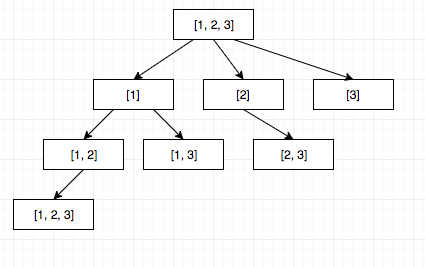

# MIDDLE

## 2. 两数相加

给出两个 非空 的链表用来表示两个非负的整数。其中，它们各自的位数是按照 逆序 的方式存储的，并且它们的每个节点只能存储 一位 数字。

如果，我们将这两个数相加起来，则会返回一个新的链表来表示它们的和。

您可以假设除了数字 0 之外，这两个数都不会以 0 开头。

Example:

```
输入：(2 -> 4 -> 3) + (5 -> 6 -> 4)
输出：7 -> 0 -> 8
原因：342 + 465 = 807
```

> 思路：额，莽就是了。

```java
/**
 * Definition for singly-linked list.
 * public class ListNode {
 *     int val;
 *     ListNode next;
 *     ListNode(int x) { val = x; }
 * }
 */
class Solution {
  public ListNode addTwoNumbers(ListNode l1, ListNode l2) {
    if (l1 == null) return l2;
    if (l2 == null) return l1;
    int tmp = 0;
    ListNode result = null, rHead = new ListNode(0);
    while (l1 != null || l2 != null) {
      int t = (l1 == null ? 0 : l1.val) + (l2 == null ? 0 : l2.val) + tmp;
      tmp = t / 10;
      if (result == null) {
        result = new ListNode(t % 10);
        rHead = result;
      } else {
        result.next = new ListNode(t % 10);
        result = result.next;
      }
      if (l1 != null)
        l1 = l1.next;
      if (l2 != null)
        l2 = l2.next;
    }
    if (tmp == 1) {
      result.next = new ListNode(tmp);
    }
    return rHead;
  }
}
```

## 3. 无重复字符的最长子串

给定一个字符串，请你找出其中不含有重复字符的 最长子串 的长度。

Example:

```
输入: "abcabcbb"
输出: 3 
解释: 因为无重复字符的最长子串是 "abc"，所以其长度为 3。
```

> 思路：
> 1. 我的思路
>   1) 设置 map，存储元素；
>   2) 遍历元素，如果该元素出现过，那么找到之前的这个元素, 清空map，重新记录；
>   3) 从这个元素的下一个开始重新计算。
> 
> 2. 大神的思路
>   1) 设置 map，存储元素的索引；设置计算长度的起始点；
>   2) 如果该元素出现过，那么，对比该元素之前的索引与现在的起点大小，如 之前索引 小于 现在起点，那么意味着 之前索引 到 目前索引肯定存在重复值，所以选择较大的那个，为了排除这个重复值，需要将索引 +1；
>   3) 计算当前索引到起点的长度与最大长度作对比
>   4) 存储/更新当前元素的索引。

```java
class Solution {
  public static int lengthOfLongestSubstring(String s) {
    int max = 0, start = 0;
    Map<Character, Integer> obj = new HashMap<>();
    for (int i = 0; i < s.length(); i++) {
      char t = s.charAt(i);
      if (obj.containsKey(t))
        start = Math.max(start, obj.get(t) + 1);
      max = Math.max(max, i - start + 1);
      obj.put(t, i);
    }
    return max;
  }
}
```

## 5. 最长回文子串

给定一个字符串 s，找到 s 中最长的回文子串。你可以假设 s 的最大长度为 1000。

Example:

```
输入: "babad"
输出: "bab"
注意: "aba" 也是一个有效答案。
```

> 思路：
> 1. 以当前元素为中心，和以当前元素和下一个元素为中心进行中心扩展。

```java
class Solution {
  public String longestPalindrome(String s) {
    if (s.isEmpty())
      return "";
    int idx = 0, left = 0, right = 0;
    String result = "";
    while (idx < s.length()) {
      int current = Math.max(handler(s, idx - 1, idx + 1), handler(s, idx, idx + 1));
      if (current > right - left + 1) {
        left = idx - (int) Math.floor((current - 1) / 2);
        right = idx + (int) Math.floor(current / 2);
      }
      idx++;
    }
    return s.substring(left, right + 1);
  }

  private int handler(String s, int left, int right) {
    while (left >= 0 && right < s.length()) {
      if (s.charAt(left) == s.charAt(right)) {
        left--;
        right++;
      } else {
        break;
      }
    }
    return right - left - 1;
  }
}
```

## 6. Z 字形变换

将一个给定字符串根据给定的行数，以从上往下、从左到右进行 Z 字形排列。

Example:

```
输入: s = "LEETCODEISHIRING", numRows = 4
输出: "LDREOEIIECIHNTSG"
解释:

L     D     R
E   O E   I I
E C   I H   N
```

> 思路：对 nusRows * 2 - 2 进行求余。

```java
class Solution {
  public String convert(String s, int numRows) {
    if (s.length() <= 1 || numRows <= 1) return s;

    String[] r = new String[numRows];
    for (int i = 0; i < numRows; i++)
      r[i] = "";
    int p = numRows * 2 - 2;
    for (int i = 0; i < s.length(); i++) {
      int t = i % p;
      r[t < p / 2 ? t : p - t] = r[t < p / 2 ? t : p - t] + s.charAt(i);
    }

    StringBuffer sb = new StringBuffer();
    for (String val : r) {
      sb.append(val);
    }
    return sb.toString();
  }
}
```

## 8. 字符串转换整数 (atoi)

请你来实现一个 parserInt 函数，使其能将字符串转换成整数。

Example:

```
输入: "   -42"
输出: -42
解释: 第一个非空白字符为 '-', 它是一个负号。
     我们尽可能将负号与后面所有连续出现的数字组合起来，最后得到 -42 。
```

> 思路：计算溢出真恶心

```java
class Solution {
  public int myAtoi(String str) {
    Integer sum = 0;
    Boolean flag = true;
    str = str.trim();
    if (str.length() == 0) return sum;
    
    int i = 0;
    if (str.charAt(0) == '-' || str.charAt(0) == '+') {
      flag = str.charAt(0) == '+';
      i = 1;
    }

    for (; i < str.length(); i++) {
      int tInt = (int)str.charAt(i) - 48;
      if (tInt <= 9 && tInt >= 0) {
        if (flag) {
          if (Integer.MAX_VALUE / 10 < sum ) return Integer.MAX_VALUE;
          else if (Integer.MAX_VALUE / 10 == sum) {
            if (tInt > 7) return Integer.MAX_VALUE;
          }
        } else {
          if (Integer.MIN_VALUE / -10 < sum) return Integer.MIN_VALUE;
          else if (Integer.MIN_VALUE / -10 == sum) {
            if (tInt >= 8) return Integer.MIN_VALUE;
          }
        }
        sum = sum * 10 + tInt;
      } else
        break;
    }
    return flag ? sum : -1 * sum;
  }
}
```

## 11. 盛最多水的容器

给定 n 个非负整数 a1，a2，...，an，每个数代表坐标中的一个点 (i, ai) 。在坐标内画 n 条垂直线，垂直线 i 的两个端点分别为 (i, ai) 和 (i, 0)。找出其中的两条线，使得它们与 x 轴共同构成的容器可以容纳最多的水。

说明：你不能倾斜容器，且 n 的值至少为 2。


图中垂直线代表输入数组 [1,8,6,2,5,4,8,3,7]。在此情况下，容器能够容纳水（表示为蓝色部分）的最大值为 49。

> 思路：双指针，取开头和结尾，一步一步向内逼近。

```javascript
/**
 * @param {number[]} height
 * @return {number}
 */
var maxArea = function(height) {
  let l = 0, r = height.length - 1;
  let max = 0;
  while (l < r) {
    let h = Math.min(height[l], height[r]);
    max = Math.max(max, (r - l) * h);
    if (height[l] > height[r]) r--;
    else l++;
  }
  return max;
};
```

## 12. 整数转罗马数字

罗马数字包含以下七种字符： I， V， X， L，C，D 和 M。

字符          数值
I             1
V             5
X             10
L             50
C             100
D             500
M             1000
例如， 罗马数字 2 写做 II ，即为两个并列的 1。12 写做 XII ，即为 X + II 。 27 写做  XXVII, 即为 XX + V + II 。

通常情况下，罗马数字中小的数字在大的数字的右边。但也存在特例，例如 4 不写做 IIII，而是 IV。数字 1 在数字 5 的左边，所表示的数等于大数 5 减小数 1 得到的数值 4 。同样地，数字 9 表示为 IX。这个特殊的规则只适用于以下六种情况：

I 可以放在 V (5) 和 X (10) 的左边，来表示 4 和 9。
X 可以放在 L (50) 和 C (100) 的左边，来表示 40 和 90。 
C 可以放在 D (500) 和 M (1000) 的左边，来表示 400 和 900。
给定一个整数，将其转为罗马数字。输入确保在 1 到 3999 的范围内。

> 思路：做数组将对应的值存储起来，双层循环，从最大的值开始

```javascript
/**
 * @param {number} num
 * @return {string}
 */
var intToRoman = function (num) {
  let arr_num = [1, 4, 5, 9, 10, 40, 50, 90, 100, 400, 500, 900, 1000];
  let arr_lm = ["I", "IV", "V", "IX", "X", "XL", "L", "XC", "C", "CD", "D", "CM", "M"];

  let result = "";
  for (let i = arr_lm.length; i >= 0; i--) {
    while (num >= arr_num[i]) {
      num -= arr_num[i];
      result += arr_lm[i];
    }
  }
  return result;
};
```

## 15. 三数之和

给定一个包含 n 个整数的数组 nums，判断 nums 中是否存在三个元素 a，b，c ，使得 a + b + c = 0 ？找出所有满足条件且不重复的三元组。

注意：答案中不可以包含重复的三元组。

Example:

```
例如, 给定数组 nums = [-1, 0, 1, 2, -1, -4]，

满足要求的三元组集合为：
[
  [-1, 0, 1],
  [-1, -1, 2]
]
```

> 思路：
> 1. 对数组进行排序，创建三个指针；
> 2. 以第一个指针为基准开始循环，第二个指针为第一个指针的下一个，第三个指针为数组尾；
> 3. 三个值相加如果等于 0，则push进答案并去重进入下一个循环；如果 大于0，说明第三个指针过大；小于0 说明第二个指针过小；
> 4. 内循环结束后，对外循环去重。

```javascript
/**
 * @param {number[]} nums
 * @return {number[][]}
 */
var threeSum = function(nums) {
  let len = nums.length;
  nums = nums.sort((a, b) => a - b);
  if (len <= 2) return [];
  let result = [];
  for (let x = 0; x < len - 2;) {
    for (let y = x + 1, z = len - 1; y < z;) {
      let t = nums[x] + nums[y] + nums[z];
      if (t === 0) {
        result.push([nums[x], nums[y], nums[z]])
        do {
          y++;
        } while (y < z && nums[y] === nums[y - 1]);
        do {
          z--;
        } while (y < z && nums[z] === nums[z + 1]);
      } else if (t > 0) {
        z--;
      } else {
        y++;
      }
    }
    do {
      x++
    } while(x < len - 2 && nums[x] === nums[x - 1]);
  }
  return result;
};
```

## 16. 最接近的三数之和

给定一个包括 n 个整数的数组 nums 和 一个目标值 target。找出 nums 中的三个整数，使得它们的和与 target 最接近。返回这三个数的和。假定每组输入只存在唯一答案。

```
例如，给定数组 nums = [-1，2，1，-4], 和 target = 1.

与 target 最接近的三个数的和为 2. (-1 + 2 + 1 = 2).
```

> 思路：同上一题。

```javascript
/**
 * @param {number[]} nums
 * @param {number} target
 * @return {number}
 */
var threeSumClosest = function(nums, target) {
  let len = nums.length;
  if (len <= 2) return [];
  nums = nums.sort((a, b) => a - b);
  let min = nums[0] + nums[1] + nums[2];
  for (let x = 0; x < len - 2;) {
    for (let y = x + 1, z = len - 1; y < z;) {
      let t = nums[x] + nums[y] + nums[z];
      if (Math.abs(t - target) < Math.abs(min - target)) {
        min = t;
      }
      if (t < target) {
        do {
          y++;
        } while(y < z && nums[y] === nums[y - 1])
      } else if (t > target) {
        do {
          z--;
        } while(y < z && nums[z] === nums[z + 1])
      } else {
        return min;
      }
    }
    do {
      x++;
    } while (x < len - 2 && nums[x] === nums[x - 1])
  }
  return min;
};
```

## 17. 电话号码的字母组合

给定一个仅包含数字 2-9 的字符串，返回所有它能表示的字母组合。

给出数字到字母的映射如下（与电话按键相同）。注意 1 不对应任何字母。


> 思路：循环或递归

```javascript
/**
 * @param {string} digits
 * @return {string[]}
 */
var letterCombinations = function(digits) {
  let dig = {
    "1": [],
    "2": ["a", "b", "c"],
    "3": ["d", "e", "f"],
    "4": ["g", "h", "i"],
    "5": ["j", "k", "l"],
    "6": ["m", "n", "o"],
    "7": ["p", "q", "r", "s"],
    "8": ["t", "u", "v"],
    "9": ["w", "x", "y", "z"]
  }

  let len = digits.length;
  let t = dig[digits[len - 1]] || [];
  for (let i = len - 2; i >= 0; i--) {
    let d = dig[digits[i]];
    let t1 = [];
    for (let dVal of d) {
      for (let tVal of t) {
        t1.push(dVal + tVal);
      }
    }
    t = t1;
  }
  return t;
};
```

## 18. 四数之和

给定一个包含 n 个整数的数组 nums 和一个目标值 target，判断 nums 中是否存在四个元素 a，b，c 和 d ，使得 a + b + c + d 的值与 target 相等？找出所有满足条件且不重复的四元组。

注意：

答案中不可以包含重复的四元组。

```
给定数组 nums = [1, 0, -1, 0, -2, 2]，和 target = 0。

满足要求的四元组集合为：
[
  [-1,  0, 0, 1],
  [-2, -1, 1, 2],
  [-2,  0, 0, 2]
]
```

> 思路：四个指针

```javascript
/**
 * @param {number[]} nums
 * @param {number} target
 * @return {number[][]}
 */
var fourSum = function(nums, target) {
  let len = nums.length;
  if (len < 4) return [];
  nums = nums.sort((a, b) => a - b);
  let result = [];
  for (let a = 0; a < len - 3;) {
    for (let b = a + 1; b < len - 2;) {
      for (let c = b + 1, d = len - 1; c < d;) {
        let t = nums[a] + nums[b] + nums[c] + nums[d];
        if (t === target) {
          result.push([nums[a], nums[b], nums[c], nums[d]])
          do {
            c++;
          } while(c < d && nums[c] === nums[c - 1]);
          do {
            d--;
          } while(c < d && nums[d] === nums[d + 1])
        } else if (t > target) {
          d--;
        } else {
          c++;
        }
      }
      do {
        b++;
      } while(b < len - 2 && nums[b] === nums[b - 1])
    }
    do {
      a++;
    } while(a < len - 3 && nums[a] === nums[a - 1])
  }
  return result;
};
```

## 22. 括号生成

给出 n 代表生成括号的对数，请你写出一个函数，使其能够生成所有可能的并且有效的括号组合。

例如，给出 n = 3，生成结果为：

```
[
  "((()))",
  "(()())",
  "(())()",
  "()(())",
  "()()()"
]
```

> 思路：设置左右两个值，左值永远小于等于右值，递归。

```java
class Solution {
  private List<String> result = new ArrayList<>();
  public List<String> generateParenthesis(int n) {
    handler(n, n, "");
    return result;
  }
  private void handler(int l, int r, String s) {
    if (l == 0) {
      while (r-- > 0)
        s += ")";
      result.add(s);
      return;
    }
  
    if (l == r) {
      handler(l - 1, r, s + "(");
    } else if (l < r) {
      handler(l - 1, r, s + "(");
      handler(l, r - 1, s + ")");
    }
  }
}
```

## 24. 两两交换链表中的节点

给定一个链表，两两交换其中相邻的节点，并返回交换后的链表。

你不能只是单纯的改变节点内部的值，而是需要实际的进行节点交换。

```
给定 1->2->3->4, 你应该返回 2->1->4->3.
```

> 思路：定义一个尾节点，在每次交换后，将此次交换后的节点赋值给该节点，下次循环时需要修复下一个值。

```java
/**
 * Definition for singly-linked list.
 * public class ListNode {
 *     int val;
 *     ListNode next;
 *     ListNode(int x) { val = x; }
 * }
 */
class Solution {
  public ListNode swapPairs(ListNode head) {
    if (head == null || head.next == null) return head;
    ListNode p1 = null, p2 = head.next, tmp;
    while (head != null && head.next != null) {
      if (p1 != null)
        p1.next = head.next;
      tmp = head.next.next;
      head.next.next = head;
      head.next = tmp;
      p1 = head;
      head = tmp;
    }
    return p2;
  }
}
```

## 29. 两数相除

给定两个整数，被除数 dividend 和除数 divisor。将两数相除，要求不使用乘法、除法和 mod 运算符。

返回被除数 dividend 除以除数 divisor 得到的商。

```
输入: dividend = 7, divisor = -3
输出: -2
```

> 思路：
> 1. 使用位运算进行计算可防止超时。 
> 2. 通过将 除数一直乘以2 来逼近被除数，然后 被除数减去这个最大值，继续逼近。
> 3. 由于对 除数右移 有溢出风险，所以选择将被除数左移。

```java
class Solution {
  public int divide(int dividend, int divisor) {
    if (dividend == Integer.MIN_VALUE && divisor == -1)
      return Integer.MAX_VALUE;
    // 用来判断符号是否相异
    Boolean flag = (dividend ^ divisor) >= 0;
    Long dividendLong = Math.abs((long)dividend);
    Long divisorLong = Math.abs((long)divisor);
    int result = 0;
    for (int i = 31; i >= 0; i--) {
      if ((dividendLong >> i) - divisorLong >= 0) {
        result += (1 << i);
        dividendLong -= (divisorLong << i);
      }
    }
    return flag ? result : -result;
  }
}
```

## 31. 下一个排列

实现获取下一个排列的函数，算法需要将给定数字序列重新排列成字典序中下一个更大的排列。

如果不存在下一个更大的排列，则将数字重新排列成最小的排列（即升序排列）。

必须原地修改，只允许使用额外常数空间。

以下是一些例子，输入位于左侧列，其相应输出位于右侧列。
1,2,3 → 1,3,2
3,2,1 → 1,2,3
1,1,5 → 1,5,1

> 思路：
> 字典序：从右往左，找到第一个左值小于右值的数，然后从右往左，找到第一个大于该左值的数，交换这两个值，并将该左值(不包含)右边的进行从小到大进行排序(原来为降序，只需要改为升序)。

```javascript
/**
 * @param {number[]} nums
 * @return {void} Do not return anything, modify nums in-place instead.
 */
var nextPermutation = function(nums) {
  let len = nums.length;
  if (len <= 1) return;

  for (let i = len - 2; i >= 0; i--) {
    if (nums[i] < nums[i + 1]) {
      for (let j = len - 1; j > i; j--) {
        if (nums[i] < nums[j]) {
          swap(i, j, nums)
          break;
        }
      }
      let x = i + 1, y = len - 1;
      while (x < y) swap(x++, y--, nums)
      break;
    }
    if (i === 0) {
      let x = i, y = len - 1;
      while (x < y) swap(x++, y--, nums)
    }
  }
};

function swap(i, j, nums) {
  let t = nums[i];
  nums[i] = nums[j];
  nums[j] = t;
}
```

## 33. 搜索旋转排序数组

假设按照升序排序的数组在预先未知的某个点上进行了旋转。

( 例如，数组 [0,1,2,4,5,6,7] 可能变为 [4,5,6,7,0,1,2] )。

搜索一个给定的目标值，如果数组中存在这个目标值，则返回它的索引，否则返回 -1 。

你可以假设数组中不存在重复的元素。

你的算法时间复杂度必须是 O(log n) 级别。

```
输入: nums = [4,5,6,7,0,1,2], target = 0
输出: 4

输入: nums = [4,5,6,7,0,1,2], target = 3
输出: -1
```

> 思路：因为限定 O(log n)，所以使用二分法
> 1. 数组分为两组，那么必定有一组是有序的，判断是否在这个有序的区间内；
> 2. 如果在这个区间，继续二分法直到找到这个值；
> 3. 如果不在这个区间，则将另一个区间继续这样寻找；
> 4. 注意：由于是向下取整，最好先判断右侧是否为有序数组。

```javascript
/**
 * @param {number[]} nums
 * @param {number} target
 * @return {number}
 */
var search = function(nums, target) {
  let len = nums.length;
  if (len === 0) return -1;

  return handler(0, len - 1, nums, target);
};

function handler(l, r, nums, target) {
  if (l > r) return -1;
  let mid = (l + r) / 2 | 0;
  if (nums[mid] === target) return mid;
  if (nums[r] > nums[mid]) {
    if (nums[r] >= target && nums[mid] < target)
      return handler(mid + 1, r, nums, target);
    return handler(l, mid - 1, nums, target);
  } else {
    if (nums[l] <= target && nums[mid] > target)
      return handler(l, mid - 1, nums, target);
    return handler(mid + 1, r, nums, target)
  }
}
```

## 34. 在排序数组中查找元素的第一个和最后一个位置

给定一个按照升序排列的整数数组 nums，和一个目标值 target。找出给定目标值在数组中的开始位置和结束位置。

你的算法时间复杂度必须是 O(log n) 级别。

如果数组中不存在目标值，返回 [-1, -1]。

Example:

```
输入: nums = [5,7,7,8,8,10], target = 8
输出: [3,4]
```

> 思路：二分法
> 1. 先找左边界，从右侧逼近；
> 2. 再找右边界，从左侧逼近，注意：在跳出循环时，会出现两种情况：1. 该值等于target，2. 该值大于target

```javascript
/**
 * @param {number[]} nums
 * @param {number} target
 * @return {number[]}
 */
var searchRange = function(nums, target) {
  let result = [-1, -1];
  let len = nums.length;
  if (len === 0) return result;
  let l = 0, r = len - 1;
  while (l < r) {
    let mid = (l + r) / 2 | 0;
    if (target <= nums[mid]) r = mid;
    else l = mid + 1
  }
  if (nums[l] !== target) return result;
  result[0] = l;

  r = len - 1;
  while(l < r) {
    let mid = (l + r) / 2 | 0;
    if (target >= nums[mid]) l = mid + 1
    else r = mid;
  }
  if (nums[r] === target) result[1] = r
  else result[1] = r - 1
  return result;
};
```

## 36. 有效的数独

判断一个 9x9 的数独是否有效。只需要根据以下规则，验证已经填入的数字是否有效即可。

1. 数字 1-9 在每一行只能出现一次。
2. 数字 1-9 在每一列只能出现一次。
3. 数字 1-9 在每一个以粗实线分隔的 3x3 宫内只能出现一次。


> 思路：
> 1. 设置三个数组，分别用于存储行、列、块出现的数字
> 2. 如果该数字曾经出现过则无效。

```java
class Solution {
  public boolean isValidSudoku(char[][] board) {
    boolean[][] rowArr = new boolean[9][9],
            colArr = new boolean[9][9],
            nineArr = new boolean[9][9];
    for (int x = 0; x < 9; x++) {
      for (int y = 0; y < 9; y++) {
        if (board[x][y] != '.') {
          int c = board[x][y] - '1';
          int n = x / 3 * 3 + y / 3;
          if (rowArr[x][c] || colArr[y][c] || nineArr[n][c])
            return false;
          rowArr[x][c] = true;
          colArr[y][c] = true;
          nineArr[n][c] = true;
        }
      }
    }
    return true;
  }
}
```

## 39. 组合总和

给定一个无重复元素的数组 candidates 和一个目标数 target ，找出 candidates 中所有可以使数字和为 target 的组合。

candidates 中的数字可以无限制重复被选取。

说明：

- 所有数字（包括 target）都是正整数。
- 解集不能包含重复的组合。

Example:

```
输入: candidates = [2,3,5], target = 8,
所求解集为:
[
  [2,2,2,2],
  [2,3,3],
  [3,5]
]
```

> 思路：利用回溯法。如果不满足条件则直接终止。

```javascript
/**
 * @param {number[]} candidates
 * @param {number} target
 * @return {number[][]}
 */
var combinationSum = function(candidates, target) {
  candidates = candidates.sort((a, b) => a - b);

  let res = [];
  let tmp = [];
  handler(res, tmp, candidates, target, 0);
  return res;
};

function handler(res, tmp, candidates, target, idx) {
  if (target == 0) {
    res.push(tmp);
    return;
  }
  if (target < candidates[idx]) return;
  for (let i = idx; i < candidates.length; i++) {
    let t = [...tmp];
    t.push(candidates[i]);
    handler(res, t, candidates, target - candidates[i], i);
  }
}
```

## 40. 组合总和 II

给定一个数组 candidates 和一个目标数 target ，找出 candidates 中所有可以使数字和为 target 的组合。

candidates 中的每个数字在每个组合中只能使用一次。

说明：

- 所有数字（包括目标数）都是正整数。
- 解集不能包含重复的组合。

> 思路：使用回溯法。
> 跳过相同的元素(不包括起始元素)。

```javascript
/**
 * @param {number[]} candidates
 * @param {number} target
 * @return {number[][]}
 */
var combinationSum2 = function(candidates, target) {
  let res = [];
  let tmp = [];

  handler(res, tmp, candidates.sort((a, b) => a-b), target, 0);
  return res;
};

function handler(res, tmp, candidates, target, idx) {
  if (target === 0) {
    res.push(tmp);
    return;
  }
  if (idx >= candidates.length || candidates[idx] > target) return;
  for (let i = idx; i < candidates.length; i++) {
    // 重点
    if (i > idx && candidates[i - 1] === candidates[i]) continue;
    let t = [...tmp];
    t.push(candidates[i]);
    handler(res, t, candidates, target - candidates[i], i + 1);
  }
}
```

## 43. 字符串相乘

给定两个以字符串形式表示的非负整数 num1 和 num2，返回 num1 和 num2 的乘积，它们的乘积也表示为字符串形式

Example:

```
输入: num1 = "123", num2 = "456"
输出: "56088"
```

> 思路：长度为n和m的两数相乘，总长度绝对是 小于等于 m + n + 1 的；

```javascript
/**
 * @param {string} num1
 * @param {string} num2
 * @return {string}
 */
var multiply = function(num1, num2) {
  let num1Lidx = num1.length - 1,
      num2Lidx = num2.length - 1;
  let result = [];
  // m 长度 * n 长度，总长度不会超过 m + n + 1;
  for (let i = num1Lidx; i >= 0; i--) {
    for (let j = num2Lidx; j >= 0; j--) {
      let s = Number(num1[i]) * Number(num2[j]) + (result[i + j + 1] || 0);
      result[i + j + 1] = s % 10;
      result[i + j] = (s / 10 | 0) + (result[i + j] || 0);
    }
  }

  while(result[0] === 0) {
    result.shift()
  }
  return result.join("") || "0";
};
```

## 46. 全排列

给定一个没有重复数字的序列，返回其所有可能的全排列。

```
输入: [1,2,3]
输出:
[
  [1,2,3],
  [1,3,2],
  [2,1,3],
  [2,3,1],
  [3,1,2],
  [3,2,1]
]
```

> 思路：
> 方法一. 先对最后的几个进行排列，然后将下一个插入到该数组中
> 方法二. 先选出第一个排列，然后将剩下的进行插入

```javascript
// 方法一
/**
 * @param {number[]} nums
 * @return {number[][]}
 */
var permute = function(nums) {
  let len = nums.length;
  if (len <= 0) return [];
  let result = [],
      tmp = []
  handler(nums, result, tmp, len - 1);
  return result;
};

/**
 * @param {number[]} nums
 * @param {number[]} result
 * @param {number[]} tmp
 * @param {number} idx
 */
function handler(nums, result, tmp, idx) {
  if (idx < 0) {
    result.push(tmp);
    return;
  }
  for (let i = 0; i <= tmp.length; i++) {
    let t = [...tmp];
    t.splice(i, 0, nums[idx]);
    handler(nums, result, t, idx-1);
  }
}

// 方法二
/**
 * @param {number[]} nums
 * @return {number[][]}
 */
var permute = function(nums) {
  let result = []
  handler(nums, [], result)
  return result;
}

function handler(nums, tmp, result) {
  if (nums.length === 0) {
    result.push(tmp);
    return;
  }

  for (let i = 0; i < nums.length; i++) {
    let t = [...tmp, nums[i]]
    let numsT = nums.slice(0, i).concat(nums.slice(i + 1))
    handler(numsT, t, result)
  }
}
```

## 47. 全排列 II

给定一个可包含重复数字的序列，返回所有不重复的全排列。

Example:

```
输入: [1,1,2]
输出:
[
  [1,1,2],
  [1,2,1],
  [2,1,1]
]
```

> 思路：加个判断，如果使用过，那么跳过该元素

```javascript
/**
 * @param {number[]} nums
 * @return {number[][]}
 */
var permuteUnique = function(nums) {
  nums = nums.sort((a, b) => a - b)
  let result = []
  handler(nums, [], result)
  return result;
}

function handler(nums, tmp, result) {
  if (nums.length === 0) {
    result.push(tmp);
    return;
  }

  let prev = null;
  for (let i = 0; i < nums.length; i++) {
    if (prev === nums[i]) continue;
    prev = nums[i]
    let t = [...tmp, nums[i]]
    let numsT = nums.slice(0, i).concat(nums.slice(i + 1))
    handler(numsT, t, result)
  }
}
```

## 48. 旋转图像

给定一个 n × n 的二维矩阵表示一个图像。将图像顺时针旋转 90 度。

说明：

你必须在原地旋转图像，这意味着你需要直接修改输入的二维矩阵。请不要使用另一个矩阵来旋转图像。

> 思路：主要规律实际上是(x, y) -> (j, n - i - 1) 的循环替换，循环 4次; 实现方法为双层循环，最外层循环的次数为 floor(n / 2)，第二层起始点为外层的值，终止条件为 大于等于(n - i -1)

```javascript
/**
 * @param {number[][]} matrix
 * @return {void} Do not return anything, modify matrix in-place instead.
 */
var rotate = function(matrix) {
  let len = matrix.length;
  for (let i = 0; i < (len / 2 | 0); i++) {
    for (let j = i; j < len - 1 - i; j++) {
      let count = 0;
      let x = i, y = j;
      let t1 = matrix[x][y];
      while(count++ < 4) {
        let t = x;
        x = y;
        y = len - 1 - t;
        let t2 = matrix[x][y];
        matrix[x][y] = t1;
        t1 = t2;
      }
    }
  }
};
```

## 49. 字母异位词分组

给定一个字符串数组，将字母异位词组合在一起。字母异位词指字母相同，但排列不同的字符串。

输入: ["eat", "tea", "tan", "ate", "nat", "bat"],
输出:
[
  ["ate","eat","tea"],
  ["nat","tan"],
  ["bat"]
]

> 思路：排序……

```javascript
/**
 * @param {string[]} strs
 * @return {string[][]}
 */
var groupAnagrams = function(strs) {
  let tmp = {};
  for (let val of strs) {
    let t = val.split("").sort().join("");
    if (tmp[t]) tmp[t].push(val);
    else tmp[t] = [val];
  }
  let result = [];
  for (let key in tmp)
    result.push(tmp[key]);
    
  return result;
};
```

## 50. Pow(x, n)

实现 pow(x, n) ，即计算 x 的 n 次幂函数。

> 思路：快速幂

```java
class Solution {
  public double myPow(double x, int n) {

    double base = x, result = 1;
    int m = Math.abs(n);
    while(m != 0) {
      if ((m & 1) != 0)
        result *= base;
      base *= base;
      m >>>= 1;
    }
    return n >= 0 ? result : 1 / result;
  }
}
```

## 54. 螺旋矩阵

给定一个包含 m x n 个元素的矩阵（m 行, n 列），请按照顺时针螺旋顺序，返回矩阵中的所有元素。

Exceple:

```
输入:
[
 [ 1, 2, 3 ],
 [ 4, 5, 6 ],
 [ 7, 8, 9 ]
]
输出: [1,2,3,6,9,8,7,4,5]
```

> 思路：注意判断边界

```javascript
/**
 * @param {number[][]} matrix
 * @return {number[]}
 */
var spiralOrder = function (matrix) {
  let result = [];
  let row = matrix.length,
    col = (matrix[0] || []).length;
  for (let i = 0; i < Math.ceil(row / 2); i++) {
    let j = i;
    for (; j < col - i; j++)
      result.push(matrix[i][j])
    let x = i + 1;
    j--;
    for (; x < row - i && j >= i; x++)
      result.push(matrix[x][j])
    x--;
    for (j--; j >= i && x > i; j--)
      result.push(matrix[x][j])
    j++;
    for (x--; x > i && j < col - i - 1; x--)
      result.push(matrix[x][j])
  }
  return result;
};
```

## 55. 跳跃游戏

给定一个非负整数数组，你最初位于数组的第一个位置。

数组中的每个元素代表你在该位置可以跳跃的最大长度。

判断你是否能够到达最后一个位置。

Example:

```
输入: [2,3,1,1,4]
输出: true
解释: 从位置 0 到 1 跳 1 步, 然后跳 3 步到达最后一个位置。
```

> 思路：
> 1. 如果不存在为 0 的数，那么肯定能到达最后一个位置
> 2. 除最后一位外，如果 i 位置为 0，那么向前查找是否存在 j 位置使得 j + nums\[j\] > i

```javascript
/**
 * @param {number[]} nums
 * @return {boolean}
 */
var canJump = function(nums) {
  let len = nums.length;
  let pos = undefined;
  for (let i = len - 2; i >= 0; i--) {
    if (nums[i] === 0 && pos === undefined)
      pos = i;
    if (pos !== undefined && i + nums[i] > pos)
      pos = undefined
  }
  return pos === undefined
};
```

## 56. 合并区间

给出一个区间的集合，请合并所有重叠的区间。

Example

```
输入: [[1,3],[2,6],[8,10],[15,18]]
输出: [[1,6],[8,10],[15,18]]
解释: 区间 [1,3] 和 [2,6] 重叠, 将它们合并为 [1,6].
```

> 思路：排序，比较头尾大小

```javascript
/**
 * @param {number[][]} intervals
 * @return {number[][]}
 */
var merge = function(intervals) {
  if (intervals.length <= 1) return intervals;
  intervals = intervals.sort((a, b) => a[0] - b[0]);

  let result = [];
  let t = [...intervals[0]];
  for (let i = 1; i < intervals.length; i++) {
    let l = intervals[i][0], r = intervals[i][1];
    if (l > t[1]) {
      result.push(t);
      t = [...intervals[i]];
    } else {
      if (l < t[0]) t[0] = l
      if (r > t[1]) t[1] = r
    }
  }
  result.push(t);
  return result;
};
```

## 59. 螺旋矩阵 II

给定一个正整数 n，生成一个包含 1 到 n2 所有元素，且元素按顺时针顺序螺旋排列的正方形矩阵。

Example:

```
输入: 3
输出:
[
 [ 1, 2, 3 ],
 [ 8, 9, 4 ],
 [ 7, 6, 5 ]
]
```

> 思路：注意判断边界条件

```java
class Solution {
  public int[][] generateMatrix(int n) {
    int[][] result = new int[n][n];
    int val = 1;
    for (int i = 0; i < (int)Math.floor((n + 1) / 2); i++) {
      for (int j = i; j < n - i; i++) {
        // 四周终止位置
        int l = i, u = i, r = n - 1 - i, d = n - 1 - i;
        for (int _a = i; _a <= r; _a++) // 上
          result[u][_a] = val++;
        for (int _b = i + 1; _b <= d; _b++) // 右
          result[_b][r] = val++;
        for (int _c = r - 1; _c >= l; _c--) // 下
          result[d][_c] = val++;
        for (int _d = d - 1; _d > u; _d--) // 左
          result[_d][l] = val++;
      }
    }
    return result;
  }
}
```

## 60. 第k个排列

给出集合 [1,2,3,…,n]，其所有元素共有 n! 种排列。

按大小顺序列出所有排列情况，并一一标记，当 n = 3 时, 所有排列如下：

- "123"
- "132"
- "213"
- "231"
- "312"
- "321"
给定 n 和 k，返回第 k 个排列。

说明：

给定 n 的范围是 [1, 9]。
给定 k 的范围是[1,  n!]

Example:

```
输入: n = 4, k = 9
输出: "2314"
```

> 思路：比如n = 4，那么以1开头的单词有 3 * 2 * 1 个；n = 3，以1开头的单词有 2 * 1个，依次类推，只要得出 k 是当前阶乘的多少倍，那么就获取剩下的当中的第几个单词。

```javascript
/**
 * @param {number} n
 * @param {number} k
 * @return {string}
 */
var getPermutation = function(n, k) {
  let m = 1;
  k = k - 1;
  for (let i = 2; i < n; i++) m *= i;

  let a = [];
  for (let i = 1; i <= n; i++) a.push(i)

  let s = []
  for (let i = 0; i < n; i++) {
    let t = k / m | 0
    s[i] = a[t]
    a.splice(t, 1)
    k %= m
    m /= (n - i - 1)
  }
  return s.join("");
};
```

## 61. 旋转链表

给定一个链表，旋转链表，将链表每个节点向右移动 k 个位置，其中 k 是非负数。

Example:

```
输入: 1->2->3->4->5->NULL, k = 2
输出: 4->5->1->2->3->NULL
解释:
向右旋转 1 步: 5->1->2->3->4->NULL
向右旋转 2 步: 4->5->1->2->3->NULL
```

> 思路：
> 先求出链表的长度，然后取余计算出到底需要移动几次。
> 右移 k 次，也就是左移 n - k 次。

```java
/**
 * Definition for singly-linked list.
 * public class ListNode {
 *     int val;
 *     ListNode next;
 *     ListNode(int x) { val = x; }
 * }
 */
class Solution {
  public ListNode rotateRight(ListNode head, int k) {
    if (head == null) return head;
    // 遍历链表，求出长度
    int len = 0;
    ListNode p1 = head, p2 = head, p3 = head;
    while(len++ != -1 && p1.next != null) p1 = p1.next;

    if ((k %= len) == 0) return head;

    for (int i = 0; true; i++) {
      if (i + 1 == (len - k)) {
        p3 = p2.next;
        p2.next = null;
        p1.next = head;
        break;
      }
      p2 = p2.next;
    }

    return p3;
  }
}
```

## 62. 不同路径

一个机器人位于一个 m x n 网格的左上角 （起始点在下图中标记为“Start” ）。

机器人每次只能向下或者向右移动一步。机器人试图达到网格的右下角（在下图中标记为“Finish”）。

问总共有多少条不同的路径？


Example:

```
输入: m = 3, n = 2
输出: 3
解释:
从左上角开始，总共有 3 条路径可以到达右下角。
1. 向右 -> 向右 -> 向下
2. 向右 -> 向下 -> 向右
3. 向下 -> 向右 -> 向右
```

> 思路：
> 方法一：使用动态规划  d\[i\]\[j\] = d\[i - 1\]\[j\] + d\[i\]\[j - 1\]
> 方法二：组合问题，机器人一定会走 m + n - 2 步，那么向下走的步数必定为 m - 1 次，即结果为 C(m+n-2, m-1)，另外需要注意的是，Java 使用 int 可能会溢出，需要使用 double 类型。

```java
// 方法一
class Solution {
  public int uniquePaths(int m, int n) {
      int[][] result = new int[m][n];
      for (int i = 0; i < m; i++) {
        for (int j = 0; j < n; j++) {
          if (i == 0 || j == 0) {
            result[i][j] = 1;
          } else {
            result[i][j] = result[i - 1][j] + result[i][j - 1];
          }
        }
      }
      return result[m - 1][n - 1];
  }
}

// 方法二
class Solution {
  public int uniquePaths(int m, int n) {
    double k = m + n - 2;
    double t = Math.min(m - 1, n - 1);

    double result = 1;
    for (double i = 0; i < t; i++) result = result * (k - i);
    for (double i = 0; i < t; i++) result /= (t - i);
    return (int)result;
  }
}
```

## 63. 不同路径

一个机器人位于一个 m x n 网格的左上角 （起始点在下图中标记为“Start” ）。

机器人每次只能向下或者向右移动一步。机器人试图达到网格的右下角（在下图中标记为“Finish”）。

现在考虑网格中有障碍物。那么从左上角到右下角将会有多少条不同的路径？

Example:

```
输入:
[
  [0,0,0],
  [0,1,0],
  [0,0,0]
]
输出: 2
解释:
3x3 网格的正中间有一个障碍物。
从左上角到右下角一共有 2 条不同的路径：
1. 向右 -> 向右 -> 向下 -> 向下
2. 向下 -> 向下 -> 向右 -> 向右
```

> 思路：答题思路和上一题一样，使用动态规划，但是如果障碍位于边界，则该障碍之后的路径为 0.

```java
class Solution {
  public int uniquePathsWithObstacles(int[][] obstacleGrid) {
    int m = obstacleGrid.length,
        n = obstacleGrid[0].length;
    int[][] result = new int[m][n];
    result[0][0] = Math.abs(obstacleGrid[0][0] - 1);
    for (int i = 0; i < m; i++) {
      for (int j = 0; j < n; j++) {
        if (i == 0 && j == 0) continue;
        // 如果当前为障碍物，则路径为 0
        if (obstacleGrid[i][j] == 1)
          result[i][j] = 0;
        else if (i == 0)
          result[i][j] = result[i][j - 1];
        else if (j == 0)
          result[i][j] = result[i - 1][j];
        else
          result[i][j] = result[i - 1][j] + result[i][j - 1];
      }
    }
    return result[m - 1][n - 1];
  }
}
```

## 64. 最小路径和

给定一个包含非负整数的 m x n 网格，请找出一条从左上角到右下角的路径，使得路径上的数字总和为最小。

说明：每次只能向下或者向右移动一步。

Example:

```
输入:
[
  [1,3,1],
  [1,5,1],
  [4,2,1]
]
输出: 7
解释: 因为路径 1→3→1→1→1 的总和最小。
```

> 思路：核心思路依然是动态规划。既然是求最小路径，那么在每个点最小值肯定是 min(左边，上边) 相加。

```java
class Solution {
  public int minPathSum(int[][] grid) {
    int m = grid.length,
        n = grid[0].length;
    for (int i = 0; i < m; i++) {
      for (int j = 0; j < n; j++) {
        if (i == 0 && j == 0) continue;
        if (i == 0) {
          grid[i][j] += grid[i][j - 1];
        } else if (j == 0) {
          grid[i][j] += grid[i - 1][j];
        } else {
          grid[i][j] += Math.min(grid[i - 1][j], grid[i][j - 1]);
        }
      }
    }
    return grid[m - 1][n - 1];
  }
}
```

## 71. 简化路径

以 Unix 风格给出一个文件的绝对路径，你需要简化它。或者换句话说，将其转换为规范路径。

在 Unix 风格的文件系统中，一个点（.）表示当前目录本身；此外，两个点 （..） 表示将目录切换到上一级（指向父目录）；两者都可以是复杂相对路径的组成部分。更多信息请参阅：Linux / Unix中的绝对路径 vs 相对路径

请注意，返回的规范路径必须始终以斜杠 / 开头，并且两个目录名之间必须只有一个斜杠 /。最后一个目录名（如果存在）不能以 / 结尾。此外，规范路径必须是表示绝对路径的最短字符串。

Example:

```
输入："/a/../../b/../c//.//"
输出："/c"
```

> 思路：栈

```javascript
/**
 * @param {string} path
 * @return {string}
 */
var simplifyPath = function(path) {
  let result = [];
  let pathArr = path.split("\/");
  pathArr.forEach(val => {
    if (val === "..")
      result.pop();
    else if (val !== "" && val !== ".")
      result.push(val)
  })
  return "/" + result.join("/")
};
```

## 73. 矩阵置零

给定一个 m x n 的矩阵，如果一个元素为 0，则将其所在行和列的所有元素都设为 0。请使用原地算法。

Example:

```
输入: 
[
  [1,1,1],
  [1,0,1],
  [1,1,1]
]
输出: 
[
  [1,0,1],
  [0,0,0],
  [1,0,1]
]
```

> 思路：
> 方法一：将行和列头部置零
> 方法二：将符合条件的其他非零数改为指定数，最后遍历数组把指定数改为零

```javascript
// 方法一
/**
 * @param {number[][]} matrix
 * @return {void} Do not return anything, modify matrix in-place instead.
 */
var setZeroes = function(matrix) {
  let m = matrix.length;
  let n = matrix[0].length;

  let flagX = false, flagY = false;
  for (let i = 0; i < m; i++)
    if (matrix[i][0] === 0) {
      flagY = true;
      break;
    }

  for (let j = 0; j < n; j++)
    if (matrix[0][j] === 0) {
      flagX = true;
      break;
    }
  
  for (let i = 1; i < m; i++) {
    for (let j = 1; j < n; j++) {
      if (matrix[i][j] === 0) {
        matrix[0][j] = 0;
        matrix[i][0] = 0;
      }
    }
  }
  
  for (let i = 1; i < m; i++) {
    if (matrix[i][0] === 0){
      for (let j = 1; j < n; j++)
        matrix[i][j] = 0;
    }
  }

  for (let j = 0; j < n; j++) {
    if (matrix[0][j] === 0) {
      for (let i = 1; i < m; i++)
        matrix[i][j] = 0
    }
  }

  if (flagY)
    for (let i = 0; i < m; i++)
      matrix[i][0] = 0;
  if (flagX)
    for (let j = 0; j < n; j++)
      matrix[0][j] = 0;
};
```

## 74. 搜索二维矩阵

编写一个高效的算法来判断 m x n 矩阵中，是否存在一个目标值。该矩阵具有如下特性：

- 每行中的整数从左到右按升序排列。
- 每行的第一个整数大于前一行的最后一个整数。

> 思路: 对比每行的最后一个大小,如果大于该目标值,那么向前进行查找 时间复杂度 O(m+n)
> 我去，推荐做法竟然是二分法……时间复杂度 O(log m*n)

```javascript
/**
 * @param {number[][]} matrix
 * @param {number} target
 * @return {boolean}
 */
var searchMatrix = function(matrix, target) {
    let m = matrix.length,
        n = (matrix[0] || []).length;
    for (let i = 0; i < m; i++) {
        if (matrix[i][n - 1] >= target) {
            for (let j = n - 1; j >= 0; j--) {
                if (matrix[i][j] === target) return true;
                else if (matrix[i][j] < target) return false;
            }
        }
    }
    return false;
};
```

## 75. 颜色分类

给定一个包含红色、白色和蓝色，一共 n 个元素的数组，原地对它们进行排序，使得相同颜色的元素相邻，并按照红色、白色、蓝色顺序排列。

此题中，我们使用整数 0、 1 和 2 分别表示红色、白色和蓝色。

Example:

```
输入: [2,0,2,1,1,0]
输出: [0,0,1,1,2,2]
```

> 思路：设置三个指针，使其中一个指针向前走，如果 等于0，则移动到左指针处，并交换值；如果 等于2，则移动到右指针处，并交换值

```javascript
/**
 * @param {number[]} nums
 * @return {void} Do not return anything, modify nums in-place instead.
 */
var sortColors = function(nums) {
  let l = 0, r = nums.length - 1,
      p = 0;
  while (p <= r) {
    let t = nums[p]
    if (t === 0) {
      nums[p++] = nums[l];
      nums[l++] = 0;
    } else if (t === 2) {
      nums[p] = nums[r];
      nums[r--] = 2;
    } else {
      p++;
    }
  }
};
```

## 77. 组合

给定两个整数 n 和 k，返回 1 ... n 中所有可能的 k 个数的组合。

Example:

```
输入: n = 4, k = 2
输出:
[
  [2,4],
  [3,4],
  [2,3],
  [1,2],
  [1,3],
  [1,4],
]
```

> 思路：回溯法

```java
class Solution {
  private List<List<Integer>> result = new LinkedList<>();
  private int n;
  private int k;

  public List<List<Integer>> combine(int n, int k) {
    this.n = n;
    this.k = k;
    handler(1, new LinkedList<>());
    return result;
  }

  private void handler(int curr, LinkedList<Integer> tmp) {
    if (tmp.size() == k) {
      result.add(new LinkedList<>(tmp));
      return;
    }

    while(curr <= n) {
      tmp.add(curr++);
      handler(curr, tmp);
      tmp.removeLast();
    }
  }
}
```

## 78. 子集

给定一组不含重复元素的整数数组 nums，返回该数组所有可能的子集（幂集）。

说明：解集不能包含重复的子集。

Example:

```
输入: nums = [1,2,3]
输出:
[
  [3],
  [1],
  [2],
  [1,2,3],
  [1,3],
  [2,3],
  [1,2],
  []
]
```

> 思路：回溯法。思路同上一题.



```javascript
/**
 * @param {number[]} nums
 * @return {number[][]}
 */
var subsets = function(nums) {
  let result = [];
  handler(result, nums, 0, []);
  return result;
};

function handler(result, nums, start, tmp) {
  result.push(tmp);

  while (start < nums.length) {
    let t = [...tmp];
    t.push(nums[start])
    handler(result, nums, ++start, t)
  }
}
```

## 79. 单词搜索

给定一个二维网格和一个单词，找出该单词是否存在于网格中。

单词必须按照字母顺序，通过相邻的单元格内的字母构成，其中“相邻”单元格是那些水平相邻或垂直相邻的单元格。同一个单元格内的字母不允许被重复使用。

Example:

```
board =
[
  ['A','B','C','E'],
  ['S','F','C','S'],
  ['A','D','E','E']
]

给定 word = "ABCCED", 返回 true.
给定 word = "SEE", 返回 true.
给定 word = "ABCB", 返回 false.
```

> 思路：深度优先搜索 + 回溯法

```java
class Solution {
  private boolean[][] b;
  private char[][] board;
  private String word;
  private int m, n;
  public boolean exist(char[][] board, String word) {
    this.board = board;
    this.word = word;

    m = board.length;
    n = board[0].length;

    b = new boolean[m][n];

    for (int i = 0; i < m; i++) {
      for (int j = 0; j < n; j++) {
        if (handler(i, j, 0)) return true;
        else b[i][j] = false;
      }
    }
    return false;
  }

  private boolean handler(int i, int j, int curr) {
    if (!(i < m && i >= 0 && j < n && j >= 0 && !b[i][j])) return false;

    if (board[i][j] == word.charAt(curr)) b[i][j] = true;
    else return false;

    if (curr == word.length() - 1) return true;

    boolean r = handler(i - 1, j, curr + 1) ||
                handler(i, j + 1, curr + 1) ||
                handler(i + 1, j, curr + 1) ||
                handler(i, j - 1, curr + 1);
    b[i][j] = false;
    return r;
  }
}
```