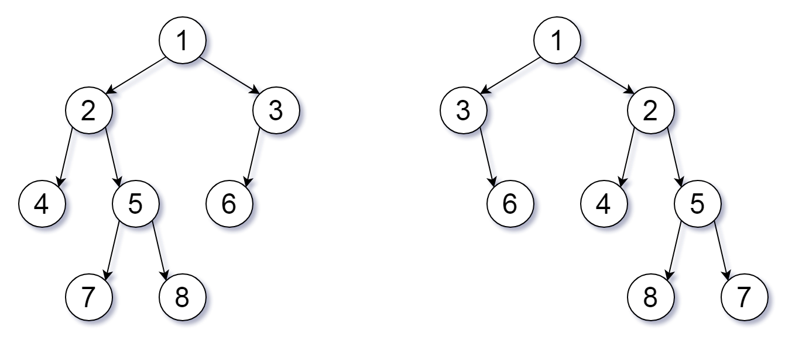

## 413. 等差数列划分

数组 A 包含 N 个数，且索引从0开始。数组 A 的一个子数组划分为数组 (P, Q)，P 与 Q 是整数且满足 0<=P<Q<N 。

如果满足以下条件，则称子数组(P, Q)为等差数组：

元素 A\[P], A\[p + 1], ..., A\[Q - 1], A\[Q] 是等差的。并且 P + 1 < Q 。

函数要返回数组 A 中所有为等差数组的子数组个数。

示例：

```
A = [1, 2, 3, 4]

返回: 3, A 中有三个子等差数组: [1, 2, 3], [2, 3, 4] 以及自身 [1, 2, 3, 4]。
```

> 思路：dp，dp\[i] = dp\[i - 1] + (当前成立的等差数组长度 - 3) + 1
> 例如 \[1,2,3] 123已成立，如果 1234 的话，则会多出两个 1234 和 234

```javascript
/**
 * @param {number[]} A
 * @return {number}
 */
var numberOfArithmeticSlices = function(A) {
  let len = A.length
  if (len < 3) return 0
  let dp = 2, result = 0,diff = A[1] - A[0]
  for (let i = 2; i < len; i++) {
    if (A[i] - A[i - 1] === diff) {
      dp++
      result += dp - 3 + 1
    } else {
      diff = A[i] - A[i - 1]
      dp = 2
    }
  }
  return result
};
```

## 494. 目标和

给定一个非负整数数组，a1, a2, ..., an, 和一个目标数，S。现在你有两个符号 + 和 -。对于数组中的任意一个整数，你都可以从 + 或 -中选择一个符号添加在前面。

返回可以使最终数组和为目标数 S 的所有添加符号的方法数。

示例 1:

```
输入: nums: [1, 1, 1, 1, 1], S: 3
输出: 5
解释: 

-1+1+1+1+1 = 3
+1-1+1+1+1 = 3
+1+1-1+1+1 = 3
+1+1+1-1+1 = 3
+1+1+1+1-1 = 3

一共有5种方法让最终目标和为3。
```

> 思路：
> 方法一：倒序记录如果得出这个结果，需要前面的数为几，可以通过记录该位置的最大值和最小值来进行剪枝
> 方法二：
> 问题转换：target = sum(正数) + sum(负数)；sum(正数) - sum(负数) = sum(nums); 两边同时加上 sum(nums) 则有
> 2 * sum(正数) = target + sum(nums)
> 即将问题转化为子集问题：一个集合中是否存在某些数使其和为 N，即01背包问题
> 注意状态转移方程 dp\[i + 1]\[j] = dp\[i]\[j] + dp\[i]\[j - nums\[i]]
> 因为选择不拿可以得到一种情况，选择拿可以为另一种情况，所以总次数为其和
> 另外，由于下一个状态只取决于上一个状态，可以改为单个数组，但是为了防止刚计算过的值就被使用，推荐倒着写，因为只要是减，那么你取到的值必然是这个值前面的

```javascript
/**
 * 方法一
 * @param {number[]} nums
 * @param {number} S
 * @return {number}
 */
var findTargetSumWays = function (nums, S) {
  let sum1 = [], sum2 = [], sum = 0
  for (let i = 0; i < nums.length; i++) {
    sum += nums[i]
    sum1[i] = sum
    sum2[i] = -sum
  }
  let result = [S]
  for (let i = nums.length - 1; i >= 0; i--) {
    let tmp = []
    for (let val of result) {
      let s1 = nums[i] + val,
          s2 = nums[i] - val
      if (
        (s1 <= sum1[i] && s1 >= sum2[i]) ||
        (s1 >= sum1[i] && s1 <= sum2[i])
      ) {
        tmp.push(s1)
      }
      if (
        (s2 <= sum1[i] && s2 >= sum2[i]) ||
        (s2 >= sum1[i] && s2 <= sum2[i])
      ) {
        tmp.push(s2)
      }
    }
    result = tmp
  }
  let n = 0
  for (let val of result) n++
  return n
};

/**
 * 方法二
 * @param {number[]} nums
 * @param {number} target
 * @return {number}
 */
var findTargetSumWays = function (nums, target) {
  let sum = nums.reduce((a, b) => a + b)
  if ((sum + target) % 2 || sum < target) return 0
  let mid = (sum + target) / 2
  let result = [1]

  for (let i = 0; i < nums.length; i++) {
    for (let j = mid; j >= 0; j--) {
      if (j >= nums[i])
        result[j] = (result[j] || 0) + (result[j - nums[i]] || 0)
    }
  }
  return result[mid]
}
```

## 801. 使序列递增的最小交换次数

我们有两个长度相等且不为空的整型数组 A 和 B 。

我们可以交换 A[i] 和 B[i] 的元素。注意这两个元素在各自的序列中应该处于相同的位置。

在交换过一些元素之后，数组 A 和 B 都应该是严格递增的（数组严格递增的条件仅为A[0] < A[1] < A[2] < ... < A[A.length - 1]）。

给定数组 A 和 B ，请返回使得两个数组均保持严格递增状态的最小交换次数。假设给定的输入总是有效的。

示例:

```
输入: A = [1,3,5,4], B = [1,2,3,7]
输出: 1
解释: 
交换 A[3] 和 B[3] 后，两个数组如下:
A = [1, 3, 5, 7] ， B = [1, 2, 3, 4]
两个数组均为严格递增的。
```

> 思路：对于任意的第 i 个元素，其排列一定有三种情况，设置两个数组：交换数组和不交换数组
> 1. A\[i] > A[i - 1] && B\[i] > B[i - 1]
> 2. A\[i] > B[i - 1] && B\[i] > A[i - 1]
> 3. 具备以上两个
> 那么：对于情况1，如果 i 交换，那么 i - 1 也必须交换，switch\[i] = switch[i - 1] + 1, noSwitch\[i] = noSwitch[i - 1]
> 对于情况2，如果 i 交换，那么 i - 1 不可交换， switch\[i] = noSwitch[i - 1], noSwitch\[i] = switch
> 对于兼具备的情况，i 交换的话，i - 1 可交换也可不交换，所以选择最小的然后 +1，不交换的话，上一个也是可交可不交

```javascript
/**
 * @param {number[]} A
 * @param {number[]} B
 * @return {number}
 */
var minSwap = function(A, B) {
  let swt = [1], noSwt = [0]
  for (let i = 1; i < A.length; i++) {
    if (A[i] > A[i - 1] && B[i] > B[i - 1]) {
      if (A[i] > B[i - 1] && B[i] > A[i - 1]) {
        swt[i] = Math.min(swt[i - 1], noSwt[i - 1]) + 1
        noSwt[i] = Math.min(swt[i - 1], noSwt[i - 1])
      } else {
        swt[i] = swt[i - 1] + 1
        noSwt[i] = noSwt[i - 1]
      }
    } else {
      swt[i] = noSwt[i - 1] + 1
      noSwt[i] = swt[i - 1]
    }
  }
  return Math.min(swt[A.length - 1], noSwt[B.length - 1])
};
```

## 931. 下降路径最小和

给定一个方形整数数组 A，我们想要得到通过 A 的下降路径的最小和。

下降路径可以从第一行中的任何元素开始，并从每一行中选择一个元素。在下一行选择的元素和当前行所选元素最多相隔一列。

 

示例：

```
输入：[[1,2,3],[4,5,6],[7,8,9]]
输出：12
解释：
可能的下降路径有：
[1,4,7], [1,4,8], [1,5,7], [1,5,8], [1,5,9]
[2,4,7], [2,4,8], [2,5,7], [2,5,8], [2,5,9], [2,6,8], [2,6,9]
[3,5,7], [3,5,8], [3,5,9], [3,6,8], [3,6,9]
和最小的下降路径是 [1,4,7]，所以答案是 12。
```

> 思路：从第二行开始，选择上一行中的最小的值

```javascript
/**
 * @param {number[][]} A
 * @return {number}
 */
var minFallingPathSum = function(A) {
  let row = A.length,
      col = (A[0] || []).length
  let result = [A[0] || []]
  for (let i = 1; i < row; i++) {
    result[i] = []
    let t = result[i - 1]
    for (let j = 0; j < col; j++) {
      if (col === 1) {
        result[i][j] = A[i][j] + t[j]
      } else if (j >= 1 && j < col - 1) {
        result[i][j] = Math.min(t[j - 1], t[j], t[j + 1]) + A[i][j]
      } else if (j === 0) {
        result[i][j] = Math.min(t[j], t[j + 1]) + A[i][j]
      } else {
        result[i][j] = Math.min(t[j - 1], t[j]) + A[i][j]
      }
    }
  }
  return Math.min(...result[row - 1])
};
```

## 967. 连续差相同的数字

返回所有长度为 N 且满足其每两个连续位上的数字之间的差的绝对值为 K 的非负整数。

请注意，除了数字 0 本身之外，答案中的每个数字都不能有前导零。例如，01 因为有一个前导零，所以是无效的；但 0 是有效的。

你可以按任何顺序返回答案。

示例 1：

```
输入：N = 3, K = 7
输出：[181,292,707,818,929]
解释：注意，070 不是一个有效的数字，因为它有前导零。
```

> 思路：用 set 存储数据，只要结尾 +K < 10 或 -K > 0 就可以继续递归

```javascript
/**
 * @param {number} N
 * @param {number} K
 * @return {number[]}
 */
var numsSameConsecDiff = function(N, K) {
  let result = new Set()
  for (let i = N > 1 ? 1 : 0; i <= 9; i++) {
    handler(result, K, N, 0, i)
  }

  return Array.from(result)
};

function handler(result, K, n, tmp, end) {
  if (n === 0) {
    result.add(tmp)
    return
  }
  if (end > 9 || end < 0) return
  tmp = tmp * 10 + end
  handler(result, K, n - 1, tmp, end + K)
  handler(result, K, n - 1, tmp, end - K)
  tmp = tmp / 10 | 0
}
```

## 978. 最长湍流子数组

当 A 的子数组 A[i], A[i+1], ..., A[j] 满足下列条件时，我们称其为湍流子数组：

- 若 i <= k < j，当 k 为奇数时， A[k] > A[k+1]，且当 k 为偶数时，A[k] < A[k+1]；
- 或 若 i <= k < j，当 k 为偶数时，A[k] > A[k+1] ，且当 k 为奇数时， A[k] < A[k+1]。
也就是说，如果比较符号在子数组中的每个相邻元素对之间翻转，则该子数组是湍流子数组。

返回 A 的最大湍流子数组的长度。 

示例 1：

```
输入：[9,4,2,10,7,8,8,1,9]
输出：5
解释：(A[1] > A[2] < A[3] > A[4] < A[5])
```

> 思路：dp，记录最后一次的长度，判断是否 A\[i] > A\[i - 1] && A\[i - 1] < A\[i - 2] 或者 A\[i] < A\[i - 1] && A\[i - 1] > A\[i - 2]，如果是则长度 +1，不是的话则判断是否 A\[i] === A\[i - 1]，是的话，则长度为 1，否则为 2

```javascript
/**
 * @param {number[]} A
 * @return {number}
 */
var maxTurbulenceSize = function (A) {
  let dp = 1,
    len = A.length,
    end = 1
  for (let i = 1; i < len; i++) {
    if (i > 1 &&
      (A[i] > A[i - 1] && A[i - 1] < A[i - 2] ||
        A[i] < A[i - 1] && A[i - 1] > A[i - 2])
    ) {
      end++
      dp = Math.max(dp, end)
    } else {
      if (A[i] > A[i - 1] || A[i] < A[i - 1]) {
        end = 2
        dp = Math.max(dp, end)
      } else {
        end = 1
      }
    }
  }
  return dp
};
```

## 1218. 最长定差子序列

给你一个整数数组 arr 和一个整数 difference，请你找出 arr 中所有相邻元素之间的差等于给定 difference 的等差子序列，并返回其中最长的等差子序列的长度。

示例 1：

```
输入：arr = [1,2,3,4], difference = 1
输出：4
解释：最长的等差子序列是 [1,2,3,4]。
```

> 思路：map 记录

```javascript
/**
 * @param {number[]} arr
 * @param {number} difference
 * @return {number}
 */
var longestSubsequence = function(arr, difference) {
  let len = arr.length
  if (len === 1) return 1
  let map = new Map(), max = 1
  map.set(arr[0], 1)
  for (let i = 1; i < len; i++) {
    let t = arr[i] - difference
    if (map.has(t)) {
      let n = map.get(t) + 1
      max = Math.max(max, n)
      map.set(arr[i], n)
    } else {
      map.set(arr[i], 1)
    }
  }
  return max
};
```

## 289. 生命游戏

根据百度百科，生命游戏，简称为生命，是英国数学家约翰·何顿·康威在1970年发明的细胞自动机。

给定一个包含 m × n 个格子的面板，每一个格子都可以看成是一个细胞。每个细胞具有一个初始状态 live（1）即为活细胞， 或 dead（0）即为死细胞。每个细胞与其八个相邻位置（水平，垂直，对角线）的细胞都遵循以下四条生存定律：

- 如果活细胞周围八个位置的活细胞数少于两个，则该位置活细胞死亡；
- 如果活细胞周围八个位置有两个或三个活细胞，则该位置活细胞仍然存活；
- 如果活细胞周围八个位置有超过三个活细胞，则该位置活细胞死亡；
- 如果死细胞周围正好有三个活细胞，则该位置死细胞复活；
- 根据当前状态，写一个函数来计算面板上细胞的下一个（一次更新后的）状态。下一个状态是通过将上述规则同时应用于当前状态下的每个细胞所形成的，其中细胞的出生和死亡是同时发生的。

示例:

```
输入: 
[
  [0,1,0],
  [0,0,1],
  [1,1,1],
  [0,0,0]
]
输出: 
[
  [0,0,0],
  [1,0,1],
  [0,1,1],
  [0,1,0]
]
```

> 思路：主要是对需要复活/死亡的做标记，最后将标记改回就行

```javascript
/**
 * @param {number[][]} board
 * @return {void} Do not return anything, modify board in-place instead.
 */
var gameOfLife = function(board) {
  let row = board.length,
      col = (board[0] || []).length
  for (let i = 0; i < row; i++) {
    for (let j = 0; j < col; j++) {
      let n = num(i, j)
      if (board[i][j] === 1) {
        if (n < 2 || n > 3) board[i][j] = 2 // 死亡
      } else {
        if (n === 3) board[i][j] = -1 // 复活
      }
    }
  }

  for (let i = 0; i < row; i++) {
    for (let j = 0; j < col; j++) {
      if (board[i][j] === 2) board[i][j] = 0
      if ( board[i][j] === -1) board[i][j] = 1 // 复活
    }
  }

  return board

  function num(i, j) {
    let n = 0
    if (i < row - 1 && j < col - 1 && board[i + 1][j + 1] >= 1) n++
    if (i < row - 1 && j > 0 && board[i + 1][j - 1] >= 1) n++
    if (i > 0 && j < col - 1 && board[i - 1][j + 1] >= 1) n++
    if (i > 0 && j > 0 && board[i - 1][j - 1] >= 1) n++
    if (i < row - 1 && board[i + 1][j] >= 1) n++
    if (i > 0  && board[i - 1][j] >= 1) n++
    if (j < col - 1 && board[i][j + 1] >= 1) n++
    if (j > 0 && board[i][j - 1] >= 1) n++
    return n
  }
};
```

## 795. 区间子数组个数

给定一个元素都是正整数的数组A ，正整数 L 以及 R (L <= R)。

求连续、非空且其中最大元素满足大于等于L 小于等于R的子数组个数。

```
例如 :
输入: 
A = [2, 1, 4, 3]
L = 2
R = 3
输出: 3
解释: 满足条件的子数组: [2], [2, 1], [3].
```

> 思路：大于等于 L 且小于等于 R 的个数 = 小于等于 R 的个数 - 小于 L 的个数

```javascript
/**
 * @param {number[]} A
 * @param {number} L
 * @param {number} R
 * @return {number}
 */
var numSubarrayBoundedMax = function(A, L, R) {
  let t1 = 0, t2 = 0, len = A.length
  for (let i = 0, j1 = 0, j2 = 0; i < len; i++) {
    if (A[i] <= R) {
      t1 += i - j1 + 1
    } else {
      j1 = i + 1
    }

    if (A[i] < L) {
      t2 += i - j2 + 1
    } else {
      j2 = i + 1
    }
  }
  return t1 - t2
};
```

## 873. 最长的斐波那契子序列的长度

如果序列 X_1, X_2, ..., X_n 满足下列条件，就说它是 斐波那契式 的：

n >= 3
对于所有 i + 2 <= n，都有 X_i + X_{i+1} = X_{i+2}
给定一个严格递增的正整数数组形成序列，找到 A 中最长的斐波那契式的子序列的长度。如果一个不存在，返回  0 。

（回想一下，子序列是从原序列 A 中派生出来的，它从 A 中删掉任意数量的元素（也可以不删），而不改变其余元素的顺序。例如， [3, 5, 8] 是 [3, 4, 5, 6, 7, 8] 的一个子序列）

示例 1：

```
输入: [1,2,3,4,5,6,7,8]
输出: 5
解释:
最长的斐波那契式子序列为：[1,2,3,5,8] 。
```

> 思路：双指针，双层循环

```javascript
/**
 * @param {number[]} A
 * @return {number}
 */
var lenLongestFibSubseq = function(A) {
  let len = A.length
  let S = new Set()
  for (let val of A) S.add(val)

  let ans = 0
  for (let i = 0; i < len; i++) {
    for (let j = i + 1; j < len; j++) {
      let x = A[j], y = A[i] + A[j]
      let l = 2
      while(S.has(y)) {
        let t = y
        y += x
        x = t
        ans = Math.max(ans, ++l)
      }
    }
  }
  return ans >= 3 ? ans : 0
};
```

## 915. 分割数组

给定一个数组 A，将其划分为两个不相交（没有公共元素）的连续子数组 left 和 right， 使得：

left 中的每个元素都小于或等于 right 中的每个元素。
left 和 right 都是非空的。
left 要尽可能小。
在完成这样的分组后返回 left 的长度。可以保证存在这样的划分方法。

示例 1：

```
输入：[5,0,3,8,6]
输出：3
解释：left = [5,0,3]，right = [8,6]
```

> 思路：总体思路是 maxLeft < minRight，那么需要定义两个数组，一个记录当前的最小值，一个记录最大值，最后比较两个数组，那么第一个maxLeft < minRight 就是答案

```javascript
/**
 * @param {number[]} A
 * @return {number}
 */
var partitionDisjoint = function(A) {
  let len = A.length
  let maxLeft = [],
      minRight = [];
  let m = A[0]
  for (let i = 0; i < len; i++) {
    m = Math.max(m, A[i])
    maxLeft[i] = m
  }
  m = A[len - 1]
  for (let i = len - 1; i >= 0; i--) {
    m = Math.min(m, A[i])
    minRight[i] = m
  }

  for (let i = 1; i < len; i++) {
    if (maxLeft[i - 1] <= minRight[i])
      return i
  }
};
```

## 945. 使数组唯一的最小增量

给定整数数组 A，每次 move 操作将会选择任意 A[i]，并将其递增 1。

返回使 A 中的每个值都是唯一的最少操作次数。

示例 1:

```
输入：[3,2,1,2,1,7]
输出：6
解释：经过 6 次 move 操作，数组将变为 [3, 4, 1, 2, 5, 7]。
可以看出 5 次或 5 次以下的 move 操作是不能让数组的每个值唯一的。
```

> 思路：找出重复值，将出现过的值存储在 set 中，将重复值排序，然后遍历递增，直到这个值未出现过，注意要记录该值，用于判断下一次循环的起点，谁大选谁，否者超时……

```javascript
/**
 * @param {number[]} A
 * @return {number}
 */
var minIncrementForUnique = function(A) {
  let arr = [], s = new Set()
  for (let val of A) {
    if (s.has(val)) arr.push(val)
    else s.add(val)
  }
  if (!arr.length) return 0
  arr = arr.sort((a, b) => a - b)
  let result = 0, start = arr[0]
  for (let val of arr) {
    start = Math.max(val, start)
    for (let i = start; true; i++) {
      if (!s.has(i)) {
        s.add(i)
        start = i
        break
      }
    }
    result += start - val
  }

  return result
};
```

## 495. 提莫攻击

在《英雄联盟》的世界中，有一个叫 “提莫” 的英雄，他的攻击可以让敌方英雄艾希（编者注：寒冰射手）进入中毒状态。现在，给出提莫对艾希的攻击时间序列和提莫攻击的中毒持续时间，你需要输出艾希的中毒状态总时长。

你可以认为提莫在给定的时间点进行攻击，并立即使艾希处于中毒状态。

示例1:

```
输入: [1,4], 2
输出: 4
原因: 在第 1 秒开始时，提莫开始对艾希进行攻击并使其立即中毒。中毒状态会维持 2 秒钟，直到第 2 秒钟结束。
在第 4 秒开始时，提莫再次攻击艾希，使得艾希获得另外 2 秒的中毒时间。
所以最终输出 4 秒。
```

> 思路：result += min(time\[i] - time[i - 1], duration) 这特么是简单题吧

```javascript
/**
 * @param {number[]} timeSeries
 * @param {number} duration
 * @return {number}
 */
var findPoisonedDuration = function(timeSeries, duration) {
  let len = timeSeries.length
  if (len === 0) return 0
  let result = 0
  for (let i = 1; i < len; i++) {
    let d = timeSeries[i] - timeSeries[i - 1]
    result += Math.min(d, duration)
  }
  result += duration
  return result
};
```

## 863. 二叉树中所有距离为 K 的结点

给定一个二叉树（具有根结点 root）， 一个目标结点 target ，和一个整数值 K 。

返回到目标结点 target 距离为 K 的所有结点的值的列表。 答案可以以任何顺序返回。

 

示例 1：

```
输入：root = [3,5,1,6,2,0,8,null,null,7,4], target = 5, K = 2

输出：[7,4,1]
```


> 思路：主要是找到一条root -> target 的路线，然后按照按路线去遍历路线的另一半节点

```javascript
/**
 * Definition for a binary tree node.
 * function TreeNode(val) {
 *     this.val = val;
 *     this.left = this.right = null;
 * }
 */
/**
 * @param {TreeNode} root
 * @param {TreeNode} target
 * @param {number} K
 * @return {number[]}
 */
var distanceK = function (root, target, K) {
  let a = [],
    result = []
  findParent(root, [])
  for (let i = 0; i < a.length; i++) {
    handler(a[i], (i === 0 ? null : a[i - 1]), K - i, result)
  }
  return result

  // 首先找到 root -> target 这条路，也就是 target 所有的父节点
  function findParent(node, arr) {
    if (node === null || a.length) return
    arr.unshift(node)
    if (node.val === target.val) {
      a = [...arr]
      return arr
    }
    findParent(node.left, arr)
    findParent(node.right, arr)
    arr.shift()
  }
};

function handler(node, next, K, result) {
  if (node === null || K < 0) return
  if (K === 0) {
    result.push(node.val)
    return
  }
  if (next === null || (node.right === next && next !== null))
    handler(node.left, null, K - 1, result)
  if (next === null || (node.left === next && next !== null))
    handler(node.right, null, K - 1, result)
}
```

## 560. 和为K的子数组

给定一个整数数组和一个整数 k，你需要找到该数组中和为 k 的连续的子数组的个数。

示例 1 :

```
输入:nums = [1,1,1], k = 2
输出: 2 , [1,1] 与 [1,1] 为两种不同的情况。
```

> 思路：使用 map，sum\[i]-sum\[j] = k，则需要将和存储在 map 中，只需要看是否存在 sum\[i] - k 的和并相加

```javascript
/**
 * @param {number[]} nums
 * @param {number} k
 * @return {number}
 */
var subarraySum = function(nums, k) {
  let len = nums.length, result = 0
  let i = 0, sum = 0, map = new Map();
  map.set(0, 1)
  while(i < len) {
    sum += nums[i++]
    if (map.has(sum - k))
     result += map.get(sum - k)
    map.set(sum, (map.get(sum) || 0) + 1)
  }

  return result
};
```

## 655. 输出二叉树

在一个 m*n 的二维字符串数组中输出二叉树，并遵守以下规则：

1. 行数 m 应当等于给定二叉树的高度。
2. 列数 n 应当总是奇数。
3. 根节点的值（以字符串格式给出）应当放在可放置的第一行正中间。根节点所在的行与列会将剩余空间划分为两部分（左下部分和右下部分）。你应该将左子树输出在左下部分，右子树输出在右下部分。左下和右下部分应当有相同的大小。即使一个子树为空而另一个非空，你不需要为空的子树输出任何东西，但仍需要为另一个子树留出足够的空间。然而，如果两个子树都为空则不需要为它们留出任何空间。
每个未使用的空间应包含一个空的字符串""。
使用相同的规则输出子树。
示例 1:

```
输入:
     1
    /
   2
输出:
[["", "1", ""],
 ["2", "", ""]]
```

> 思路：先计算总长度，然后计算中间的位置，左边的为 (start + idx - 1) / 2 ，右边为 (idx + 1 + end) / 2，其中start,end 为开始结束索引，idx 为上一层的中间位置

```javascript
/**
 * Definition for a binary tree node.
 * function TreeNode(val) {
 *     this.val = val;
 *     this.left = this.right = null;
 * }
 */
/**
 * @param {TreeNode} root
 * @return {string[][]}
 */
var printTree = function(root) {
  let deep = deepFunc(root)
  let len = Math.pow(2, deep) - 1, mid = len / 2 | 0
  let result = [[]]
  result[0][mid] = root.val + ""
  handler(root, result, 0, len - 1, 1, mid)
  for(let i = 0; i < deep; i++) {
    for (let j = 0; j < len; j++) {
      if (result[i][j] === undefined)
        result[i][j] = ''
    }
  }
  result.pop()
  return result
};

function handler(node, result, start, end, dpt, idx) {
    if (node === null) return
    let lMid = (start + idx - 1) / 2,
        rMid = (idx + 1 + end) / 2
    if (!result[dpt]) result[dpt] = []
    if (node.left) {
        result[dpt][lMid] = node.left.val + ""
        handler(node.left, result, start, idx - 1, dpt + 1, lMid)
    }
    if (node.right) {
        result[dpt][rMid] = node.right.val + ""
        handler(node.right, result, idx + 1, end, dpt + 1, rMid)
    }
}

// 获取树的深度
function deepFunc(node) {
  if (node === null) return 0
  return Math.max(deepFunc(node.left), deepFunc(node.right)) + 1 
}
```

## 814. 二叉树剪枝

给定二叉树根结点 root ，此外树的每个结点的值要么是 0，要么是 1。

返回移除了所有不包含 1 的子树的原二叉树。

( 节点 X 的子树为 X 本身，以及所有 X 的后代。)

示例1:

```
输入: [1,null,0,0,1]
输出: [1,null,0,null,1]
 
解释: 
只有红色节点满足条件“所有不包含 1 的子树”。
右图为返回的答案。
```

> 思路：如果左边为false则删除左边，右边为false删除右边，返回 当前值是否等于1或其左右子树为true的

```javascript
/**
 * Definition for a binary tree node.
 * function TreeNode(val) {
 *     this.val = val;
 *     this.left = this.right = null;
 * }
 */
/**
 * @param {TreeNode} root
 * @return {TreeNode}
 */
var pruneTree = function(root) {
  handler(root)
  return root
};

function handler(node) {
  if (node === null) return false
  let a = handler(node.left)
  let b = handler(node.right)
  if (!a) node.left = null
  if (!b) node.right = null
  return node.val == 1 || a || b
}
```

## 951. 翻转等价二叉树

我们可以为二叉树 T 定义一个翻转操作，如下所示：选择任意节点，然后交换它的左子树和右子树。

只要经过一定次数的翻转操作后，能使 X 等于 Y，我们就称二叉树 X 翻转等价于二叉树 Y。

编写一个判断两个二叉树是否是翻转等价的函数。这些树由根节点 root1 和 root2 给出。

示例：

```
输入：root1 = [1,2,3,4,5,6,null,null,null,7,8], root2 = [1,3,2,null,6,4,5,null,null,null,null,8,7]
输出：true
解释：We flipped at nodes with values 1, 3, and 5.
```



> 思路：递归，总共只有两种情况：node1.left === node2.left && node1.right === node2.right 和 node1.left === node2.right && node1.right === node2.left；只要满足一种，那么久成立

```javascript
/**
 * Definition for a binary tree node.
 * function TreeNode(val) {
 *     this.val = val;
 *     this.left = this.right = null;
 * }
 */
/**
 * @param {TreeNode} root1
 * @param {TreeNode} root2
 * @return {boolean}
 */
var flipEquiv = function (root1, root2) {
  if (root1 === root2)
    return true
  if (root1 === null || root2 === null || root1.val !== root2.val)
    return false
  return (flipEquiv(root1.left, root2.left) && flipEquiv(root1.right, root2.right)) ||
          (flipEquiv(root1.left, root2.right) && flipEquiv(root1.right, root2.left))
};
```

## 1008. 先序遍历构造二叉树

返回与给定先序遍历 preorder 相匹配的二叉搜索树（binary search tree）的根结点。

(回想一下，二叉搜索树是二叉树的一种，其每个节点都满足以下规则，对于 node.left 的任何后代，值总 < node.val，而 node.right 的任何后代，值总 > node.val。此外，先序遍历首先显示节点的值，然后遍历 node.left，接着遍历 node.right。） 

示例：

```
输入：[8,5,1,7,10,12]
输出：[8,5,10,1,7,null,12]
```


> 思路：额……先序遍历，不多说了

```javascript
/**
 * Definition for a binary tree node.
 * function TreeNode(val) {
 *     this.val = val;
 *     this.left = this.right = null;
 * }
 */
/**
 * @param {number[]} preorder
 * @return {TreeNode}
 */
var bstFromPreorder = function(preorder) {
  if (preorder.length === 0) return null
  return handler(preorder, 0, preorder.length - 1)
};

function handler(preorder, start, end) {
  if (start > end) return null
  let val = preorder[start]
  let node = new TreeNode(val)
  let i = start + 1
  while (i <= end && preorder[i] < val) {
    i++
  }
  node.left = handler(preorder, start + 1, i - 1)
  node.right = handler(preorder, i, end)
  return node
}
```

## 958. 二叉树的完全性检验

给定一个二叉树，确定它是否是一个完全二叉树。

百度百科中对完全二叉树的定义如下：

若设二叉树的深度为 h，除第 h 层外，其它各层 (1～h-1) 的结点数都达到最大个数，第 h 层所有的结点都连续集中在最左边，这就是完全二叉树。（注：第 h 层可能包含 1~ 2h 个节点。）

示例 1：

```
输入：[1,2,3,4,5,6]
输出：true
解释：最后一层前的每一层都是满的（即，结点值为 {1} 和 {2,3} 的两层），且最后一层中的所有结点（{4,5,6}）都尽可能地向左。
```


> 思路：设置flag，然后将所有的值存储进栈，如果第一次碰见 null，则将 flag 设置为 true，如果再次循环的话，那就证明在 null 右边还有值，就不是完全二叉树

```javascript
/**
 * Definition for a binary tree node.
 * function TreeNode(val) {
 *     this.val = val;
 *     this.left = this.right = null;
 * }
 */
/**
 * @param {TreeNode} root
 * @return {boolean}
 */
var isCompleteTree = function (root) {
  if (root === null) return true
  let queue = [root], cur = null, flag = false
  while (queue.length > 0) {
    cur = queue.shift()
    if (cur === null) {
      flag = true
      continue
    }
    if (flag) return false
    queue.push(cur.left)
    queue.push(cur.right)
  }
  return true
};
```

## 1186. 删除一次得到子数组最大和

给你一个整数数组，返回它的某个 非空 子数组（连续元素）在执行一次可选的删除操作后，所能得到的最大元素总和。

换句话说，你可以从原数组中选出一个子数组，并可以决定要不要从中删除一个元素（只能删一次哦），（删除后）子数组中至少应当有一个元素，然后该子数组（剩下）的元素总和是所有子数组之中最大的。

注意，删除一个元素后，子数组 不能为空。

示例 1：

```
输入：arr = [1,-2,0,3]
输出：4
解释：我们可以选出 [1, -2, 0, 3]，然后删掉 -2，这样得到 [1, 0, 3]，和最大。
```

> 思路：
> f\[i] 表示以第i个位置的元素结尾，且不删除元素的最大子数组和
> g\[i] 表示以第i个位置的元素结尾，且删除过元素的最大子数组和
> f\[i] = max(f[i - 1] + arr\[i], arr\[i]) 从这儿开始或者累加该值
> g\[i] = max(f\[i - 1] + arr\[i], f[i - 1]) 上个删除过的元素累加该值或者跳过该值，即 f[i - 1]

```javascript
/**
 * @param {number[]} arr
 * @return {number}
 */
var maximumSum = function(arr) {
  let len = arr.length
  let f = [arr[0]],
      g = [-Infinity]
  for (let i = 1; i < len; i++) {
    f[i] = Math.max(f[i - 1] + arr[i], arr[i])  // 要么从这儿开始，要么从这儿累加
    g[i] = Math.max(g[i - 1] + arr[i], f[i - 1])  
  }
  let result = -Infinity
  for (let i = 0; i < len; i++) {
    result = Math.max(result, Math.max(f[i], g[i]))
  }
  return result
};
```

## 392. 判断子序列

给定字符串 s 和 t ，判断 s 是否为 t 的子序列。

你可以认为 s 和 t 中仅包含英文小写字母。字符串 t 可能会很长（长度 ~= 500,000），而 s 是个短字符串（长度 <=100）。

字符串的一个子序列是原始字符串删除一些（也可以不删除）字符而不改变剩余字符相对位置形成的新字符串。（例如，"ace"是"abcde"的一个子序列，而"aec"不是）。

示例 1:

```
s = "abc", t = "ahbgdc"

返回 true.
```

> 思路：额，直接遍历

```javascript
/**
 * @param {string} s
 * @param {string} t
 * @return {boolean}
 */
var isSubsequence = function(s, t) {
  if (s === t) return true
  let i = 0, j = 0
  let sLen = s.length, tLen = t.length
  while (j < tLen) {
    if (s[i] === t[j]) i++
    if (i === sLen) return true
    j++
  }
  return false
};
```

## 1049. 最后一块石头的重量 II

有一堆石头，每块石头的重量都是正整数。

每一回合，从中选出任意两块石头，然后将它们一起粉碎。假设石头的重量分别为 x 和 y，且 x <= y。那么粉碎的可能结果如下：

如果 x == y，那么两块石头都会被完全粉碎；
如果 x != y，那么重量为 x 的石头将会完全粉碎，而重量为 y 的石头新重量为 y-x。
最后，最多只会剩下一块石头。返回此石头最小的可能重量。如果没有石头剩下，就返回 0。

示例：

```
输入：[2,7,4,1,8,1]
输出：1
解释：
组合 2 和 4，得到 2，所以数组转化为 [2,7,1,8,1]，
组合 7 和 8，得到 1，所以数组转化为 [2,1,1,1]，
组合 2 和 1，得到 1，所以数组转化为 [1,1,1]，
组合 1 和 1，得到 0，所以数组转化为 [1]，这就是最优值。
```

> 思路：
> 由于石头拿走还能放回去，因此可以简单地把所有石头看作两堆
> 假设总重量为 sum, 则问题转化为背包问题：
> 如何使两堆石头总重量接近 sum / 2

```javascript
/**
 * @param {number[]} stones
 * @return {number}
 */
var lastStoneWeightII = function (stones) {
    let sum = stones.reduce((a, b) => a + b)
    let dp = [], mid = sum / 2 | 0
    for (let val of stones) {
        for (let i = mid; i >= val; i--) {
            dp[i] = Math.max(dp[i] || 0, (dp[i - val] || 0) + val)
        }
    }
    return sum - 2 * dp[mid]
};
```

## 746. 使用最小花费爬楼梯

数组的每个索引做为一个阶梯，第 i个阶梯对应着一个非负数的体力花费值 cost[i](索引从0开始)。

每当你爬上一个阶梯你都要花费对应的体力花费值，然后你可以选择继续爬一个阶梯或者爬两个阶梯。

您需要找到达到楼层顶部的最低花费。在开始时，你可以选择从索引为 0 或 1 的元素作为初始阶梯。

示例 1:

```
输入: cost = [10, 15, 20]
输出: 15
解释: 最低花费是从cost[1]开始，然后走两步即可到阶梯顶，一共花费15。
```

> 思路：只要选择dp\[i - 1] 和 dp\[i - 2] 中最小的一个加上当前值就是到达当前的最小花费。最终结果是输出 dp\[-1] 和 dp\[-2] 中最小的，因为他可以走两步，也可以走一步

```javascript
/**
 * @param {number[]} cost
 * @return {number}
 */
var minCostClimbingStairs = function(cost) {
    let dp =[cost[0], cost[1]]
    for (let i = 2; i < cost.length; i++) {
        dp[i] = Math.min(dp[i - 2], dp[i - 1]) + cost[i]
    }
    return Math.min(dp.pop(), dp.pop())
};
```